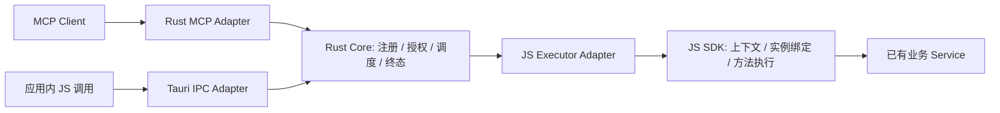

# JS 与 Rust 的框架职责划分

更新：2026-10-06。本文确定框架职责与 Interface；第 8 节记录本轮实现。统一 Tool 管线、可信入口 Caller、Rust Authorizer、就绪握手和调用事件已落地；Resource / Prompt、动态注册版本及构建工具尚未实现。领域用语见 [CONTEXT](../CONTEXT.md)，能力契约见[主设计](ai-framework-design.md)，开源参考见[调研](mcp-framework-research.md)。

## 1. 总体决策

JS 提供业务能力 SDK，并作为业务方法的 ExecutionHost；Rust 提供应用级 MCP 服务与统一运行时。

JS 定义“有哪些业务能力、怎样调用已有方法”；Rust 决定“哪些声明被接受、谁可以调用、如何调度以及本次调用何时结束”。框架在 Rust 汇合桌面应用内调用与外部 MCP 调用，业务方法的实际执行留在其绑定实例所在的 JS 环境。

统一管线适用于框架 SDK 的能力调用入口；应用自身的普通 Service 调用由业务宿主负责。

只有 Rust 接受的能力声明进入桌面模式的运行目录。JS 保存 CapabilityBinding，Rust 保存已接受的声明、有效策略与运行状态。跨进程传递 JSON 声明、调用数据和事件，方法、DI 实例、校验器函数及 AbortSignal 留在原运行环境。

上图的 Tool 请求链路已落地；结果沿反向链路返回，由 Rust 校验、裁决并映射到相应入口。

## 2. 能力与职责矩阵

| 能力 | JS 端 | Rust 端 |
| --- | --- | --- |
| `@Module` | 声明命名空间，采集实例方法元数据 | 接受模块声明，检查命名、冲突、数量与宿主允许的注册范围 |
| `@Tool` | 描述用途、Schema、行为提示与所需策略；绑定 Tool 方法 | 校验声明，提供工具发现，校验输入，执行授权与预算，再映射 ToolResult |
| `@Resource` | 描述固定 URI 或 URI 模板，绑定内容读取方法，产生文本或二进制内容 | 维护资源及模板目录，匹配具体 URI、解析模板参数、验证读取结果和映射资源协议 |
| `@Prompt` | 描述参数，绑定构造消息的方法，产生消息序列 | 提供发现与获取，检查参数及消息格式，映射 Prompt 协议 |
| 业务实例与 DI | 由宿主创建实例，SDK 绑定 `this`；Angular Adapter 获取已有 Provider | 记录绑定所属 ExecutionHost 及其可用性 |
| 注册和发现 | 提交 CapabilityManifest，维护本地方法绑定，接收注册结果 | 原子接受声明，生成注册快照与版本，按 Caller 权限和执行可用性形成目录 |
| 入口与身份 | 通过 SDK 发起请求，使用 Rust 提供的只读 Caller 上下文 | 持有 MCP 监听与凭据；认证 MCP / IPC 入口，生成可信 Caller |
| 权限 | 声明所需权限；已有业务 Service 检查业务对象权限和业务条件 | 宿主 Authorizer 执行基准访问规则与能力权限检查，施加有效执行策略 |
| 输入输出校验 | 定义 Schema，提供开发期诊断和执行侧校验，规范化可序列化结果 | 校验跨进程声明、输入与输出，决定结果能否对外发布 |
| 截止时间和取消 | 接收预算及取消消息，触发 AbortSignal，协作停止业务工作 | 计算有效预算，管理超时、取消、断链与一次终态，拒绝迟到回传 |
| 并发和队列 | 执行已准入的工作；可报告宿主执行容量 | 管理全局、Caller、能力与 ExecutionHost 限额；决定准入、排队或拒绝 |
| 进度和日志 | 通过上下文报告进度、业务阶段和受控日志 | 检查请求仍在运行，限频、脱敏并按协议版本输出 |
| 注册变化和内容更新 | 提交声明变更，报告某个资源内容已变化 | 提交注册版本、刷新目录，向有权限的订阅者发送对应通知 |
| 生命周期 | 准备与释放绑定，参与就绪握手，响应退出与取消 | 管理服务状态、桥接代际、就绪及断开，撤销不可用绑定并结束在途请求 |
| 应用内调用和状态 | 提供 invoke、资源读取、Prompt 获取、状态与事件订阅的 SDK Interface | 桌面模式统一接收调用，返回权威目录、状态、结果和事件 |

`@Module` 属于本框架的声明组织方式；`Tool / Resource / Prompt` 分别有自己的契约和协议映射。声明只记录元数据，实例注册和启动由应用显式完成。

## 3. JS 端提供的 Module

### 3.1 声明与 Contracts

根入口提供 `Module`、`Tool`，后续加入 `Resource`、`Prompt`，以及对应选项、结果类型、调用上下文和受控业务错误。函数式声明与装饰器声明进入相同注册路径。

JS 是业务契约的编写入口。SDK 采集声明生成 CapabilityManifest，其中包含模块、ToolDescriptor / ToolPolicy、资源声明、资源模板声明和 Prompt 声明，以及定位内部绑定的标识。该 Manifest 是可序列化的声明，不携带方法、对象实例或认证凭据。

Tool 输入输出、资源内容和 Prompt 消息分别建模。JS 可把业务 DTO 规范化为 Tool 结构化结果；资源二进制在通过 JSON 桥接前明确编码为 blob；Prompt 产生带角色的消息。业务方法使用能力结果类型，不构造 JSON-RPC 响应或 HTTP 流。

### 3.2 绑定与方法执行

SDK 从已提供的实例建立 CapabilityBinding，保留实例状态和 DI 依赖。Angular Adapter 获取宿主已经配置的 useValue、useFactory 或 Service 实例，按应用生命周期建立与释放绑定。

接到 Rust 派发后，SDK 查找匹配的绑定版本，建立只读上下文，运行业务检查与方法，处理受控错误并回传结果。方法第二个参数提供 requestId、source、Caller、执行预算和 AbortSignal；进度与日志通过上下文方法发送。

JS 能执行什么业务工作，由该实例及其已有 Service 决定。读取文件、数据库或原生功能时，可以调用宿主已有的 Tauri 接口；MCP 框架负责能力调用，不把资源 URI 自动映射到任意文件路径或网络请求。

### 3.3 SDK Facade 与 Adapter

- `start / stop`：准备、登记、就绪和释放当前 JS ExecutionHost。Rust 宿主持有整个 MCP 服务生命周期。
- `invoke`：在 Tauri 模式下通过 IPC 进入 Rust Tool 调用管线。
- 资源读取与 Prompt 获取：通过 IPC 进入对应 Rust 管线，再由绑定方法生成内容或消息。
- 状态、目录与事件：获取 Rust 已接受的运行视图；JS 自己的声明预览作为开发辅助信息。
- `/tauri`：封装 IPC、Channel、桥接代际与回传；根入口保持与平台无关。
- `/angular`：封装 DI 和应用生命周期。
- 构建工具：采集可静态分析的声明、生成 Manifest、DTO 类型及预编译校验器，支持严格 CSP；采集时不启动应用或实例化业务 Service。

JS 参数类型在运行时会被擦除，跨进程数据契约使用显式 Schema 或构建期生成的 Schema。

## 4. Rust 端提供的 Module

### 4.1 Registry 与运行目录

Rust 校验并原子接受 CapabilityManifest，记录绑定所在 ExecutionHost、声明版本、有效策略及就绪状态。工具按名称、固定资源按 URI、资源模板按模板声明、Prompt 按名称分别建立索引。

JS 拥有业务声明的编写权；Rust 已接受的注册快照是桌面运行时发现和调用的依据。注册变更需要 Rust 确认后才生效。注册、替换和释放由统一 Registry 管理，已接受的调用保持自己的声明与绑定快照。

资源模板的匹配、解码、参数提取与匹配歧义检查由 Rust 统一处理。业务方法接收已解析的参数和请求 URI，负责产生内容。固定资源目录、模板目录、Tool 目录与 Prompt 目录保留各自的协议语义。

### 4.2 认证、授权与执行规则

MCP 监听地址、凭据提供方式、Origin 规则、请求大小和协议版本由 Rust 宿主配置。IPC 入口根据 Tauri 提供的可信来源及宿主配置产生本地 Caller。JS 提交的是目标和业务参数，身份与 source 从入口上下文生成。

Rust Host Authorizer 决定基准访问规则、能力所需权限及目录可见性。权限标识和角色的含义由应用配置，框架执行检查。声明了非空权限要求而没有对应 Authorizer 时拒绝执行。

业务对象权限由已有业务 Service 检查，例如“该 Caller 能否读取文档 123”。这些业务检查可以在 JS 执行阶段拒绝本次操作，不能扩大 Rust 已确认的权限、放宽预算或改变 Caller。Rust 业务扩展也可以实现相应检查；框架不复制领域事务或数据访问规则。

有效预算和并发策略由 Rust 合并能力声明与宿主限制产生，计入授权、校验、排队及执行所消耗的预算。Rust 内部使用单调时钟计时；传给 JS 的 deadline / 剩余预算用于协作执行，不能延长该调用的有效预算。

### 4.3 调度与结果裁决

Rust 接受 Tool 调用、Resource 读取和 Prompt 获取，在共享的认证、授权、准入与生命周期规则下，采用各自的输入、输出与错误约定。

每次请求记录本次注册快照、ExecutionHost 代际、请求编号、Caller 和预算。首个 Executor Adapter 派发到 JS；将来需要原生处理方法时，可以增加 Rust Executor Adapter，并走相同的管线。

JS 回传代表一次执行结果。Rust 检查回传来源、请求与绑定代际、截止时间、取消状态、体积及能力结果契约，再接受为调用终态。协议错误、业务错误和宿主不可用分别按对应能力映射。

超时和取消由 Rust 裁决并通知 JS。即使 JS 事件循环阻塞，Rust 也能结束等待和拒绝之后的成功回传；业务方法是否已经停止以及副作用是否完成，由业务执行与最终状态查询确认。

### 4.4 MCP、事件与宿主生命周期

MCP Adapter 负责发现、调用、资源读取、Prompt 获取、错误、进度和通知的协议映射，复用 rmcp。协议兼容和传输细节集中于 Adapter；Runtime 处理领域注册与执行规则。

Rust 产生全链路状态与审计事件，包括在 JS 派发前被拒绝的调用。JS 上报的业务阶段、进度和日志作为执行信息补充，调用终态以 Rust 记录为准。JS UI 通过 SDK 订阅该视图。

服务监听与 JS 就绪分别管理。JS 暂时断开时，Rust 撤销其绑定的可执行状态、处理在途请求，并可继续提供 MCP 入口与服务状态。应用退出时，Rust 有界停止监听、订阅和执行资源。URI、执行宿主代际等属于运行基础设施，业务声明保持应用级能力语义。

## 5. 跨进程 Interface 与共享约定

以下是下一版必须具备的桥接操作语义，命令及 DTO 名称在实现时统一确定：

| 操作 | 发起端 | 作用 |
| --- | --- | --- |
| 登记 / 更新 / 释放能力 | JS → Rust | 提交纯数据声明，返回已接受的注册版本与绑定信息 |
| 就绪 / 不可用 | JS ↔ Rust | 确认当前代际的绑定已经准备完成，或撤销其可用性 |
| Tool 调用 / Resource 读取 / Prompt 获取 | JS → Rust | 桌面应用内请求进入 Rust 对应调用管线 |
| 派发执行 | Rust → JS | 发送能力种类、目标、绑定版本、已解析参数与可信上下文 |
| 回传结果 | JS → Rust | 提交对应能力结果或受控业务错误，等待 Rust 接受 |
| 取消 | Rust → JS | 传递结构化原因，包括 TIMEOUT、CANCELLED、宿主断开等 |
| 本地取消请求 | JS → Rust | 请求取消自己发起的调用，由 Rust 检查请求归属并裁决 |
| 进度 / 日志 / 内容已变化 | JS → Rust | 报告绑定方法的执行信息与内容变化，由 Rust 校验后处理 |
| 查询 / 订阅运行视图 | JS ↔ Rust | 获取目录、服务状态、注册状态与调用事件 |

回传及事件均关联请求或注册、ExecutionHost 代际和绑定版本。完成一次调用后，重复结果、旧代际结果与进度都不能改变其终态。原始 Bearer、认证 header、回调闭包和框架内部取消对象不进入业务上下文。

桥接 Schema 与语义用例由一份中立契约维护，生成或校验 TS / Rust DTO；业务 Schema 由业务声明提供。JS 的预检和 Rust 的检查遵守同一方言、边界值和序列化规则，使用共享测试数据验证一致性。Rust 保留跨进程入口与最终发布的校验权，JS 校验用于开发反馈和执行侧诊断。

新桥接版本直接采用上述约定；不支持的内部版本拒绝连接并报告 PROTOCOL_MISMATCH。MCP 协议版本按真实验收矩阵支持，与内部桥接版本分别管理。

## 6. 关键链路

### 6.1 登记与启动

1. JS 宿主提供业务实例，SDK 采集声明、建立 CapabilityBinding。
2. JS 提交 Manifest；Rust 校验声明和宿主约束，建立尚未就绪的注册版本。
3. Rust 返回本次桥接代际与已接受版本；JS 确认绑定及消息接收已准备完成。
4. Rust 接受就绪确认，使对应能力进入可用目录，SDK 的 start 才成功结束。
5. 任一步失败都释放本次登记与桥接资源，公开状态保持明确；Rust 的监听状态单独记录。

### 6.2 请求与执行

1. MCP 或应用内 IPC 入口认证并产生 Caller。
2. Rust 查找目标与可用绑定，检查对应输入契约、访问规则和容量，捕获注册快照及预算。
3. Rust 派发到 JS；JS 运行已有业务检查和绑定方法，提供协作取消、进度与结果规范化。
4. JS 回传；Rust 检查关联信息、有效预算和结果契约，裁决一次终态。
5. Rust 通过 MCP Adapter 或 IPC 返回结果，并发布运行事件。

### 6.3 停止、超时与断开

停止当前 JS ExecutionHost 时，先请求 Rust 撤销可用性和新调用准入，取消或有界等待在途请求，再释放 JS 绑定。Rust 显式释放注册与监听的动作分别管理。

截止时间、客户端取消、HTTP 请求 Future 被丢弃或执行宿主断开，由 Rust 结束对应请求并尽力发送结构化取消消息。JS AbortSignal 请求业务方法停止；迟到回传受到相同的代际与终态检查。

## 7. 纯浏览器调试与业务责任

纯浏览器模式使用独立的 Browser Adapter，在 JS 内执行注册、校验、预算与调用流程，供示例、单元测试和开发调试使用。它共享能力契约与语义用例，但运行状态属于该调试 Runtime。切换到 Tauri 模式后，SDK 必须通过 Rust；Rust 不可用时返回明确错误，不自动切换成绕过 Rust 的本地执行。

业务负责真实数据访问、对象权限、事务、幂等、外部接口调用、CPU 密集工作的执行方式及最终状态确认。Tool 也可以做只读查询；Resource 按 URI 提供内容；Prompt 组织消息。框架统一管理这些能力的声明和调用，不承担模型推理或业务工作流引擎。

## 8. 本轮实现状态

| 关注点 | 已实现 | 后续工作 |
| --- | --- | --- |
| 声明与绑定 | Module / Tool；annotations 与 policy 分开；[registry.ts](../guest-js/registry.ts) 原子保存声明和实例方法 | Resource / Prompt 的独立契约、静态 Manifest |
| 统一调用 | [runtime.ts](../guest-js/runtime.ts) 只通过 Adapter 发起调用；桌面 IPC 与 MCP 汇入 Rust；[executor.ts](../guest-js/executor.ts) 执行派发 | Resource / Prompt 及原生 Executor |
| 授权与 Caller | Rust RuntimeConfig.authorizer 同时检查目录与两个入口；非空 permissions 无 Authorizer 时拒绝；Caller 从入口生成 | 多用户账号、角色及 Caller 限额；当前 principal 是入口标识 |
| 桥接上下文 | v2 传 caller、deadline 和结构化取消 error；旧版本返回 PROTOCOL_MISMATCH | 中立 Schema 生成 DTO、注册版本、进度与日志 |
| 就绪 | connect 原子登记；ready 后开放目录和调用；JS start 等待确认；失败释放本次连接 | 动态 add / replace / remove、RegistryRevision 与目录通知 |
| 预算与终态 | Rust 单调时钟记录有效预算，接受结果前后检查；Host 可收紧预算与容量；单工具并发；一次终态及迟到回传拒绝 | Caller / ExecutionHost 限额及有界队列 |
| 运行视图 | start 返回授权目录；Rust Channel 发送调用状态和 pendingCount，包含进入 Rust 后的派发前拒绝 | 独立状态查询、持久审计、内容及目录变化通知 |
| Angular | [angular.ts](../guest-js/angular.ts) 获取宿主既有 Provider；useValue / useFactory 回归；示例显式提供实例 | 保持适配层负责 DI 和应用生命周期 |
| 平台依赖 | 根入口纯 SDK，Ping 删除；[tauri.ts](../guest-js/tauri.ts) 单独封装 IPC；Browser Adapter 用于独立调试 | 严格 CSP 校验器生成及可选 HTTP Cargo feature |
| MCP 映射 | 四项 ToolAnnotations；未知 Tool 是协议错误，业务 NOT_FOUND 仍是工具错误；只声明 tools | Resource、Prompt、进度、订阅及版本矩阵 |

本轮采用新接口，没有旧名称、旧字段或桥接 v1 的兼容实现。验证结果见[验收记录](verification.md)；尚未实现的完整框架目标保留在前文和主设计中。

## 9. 实施与验收顺序

| 批次 | JS 工作 | Rust 工作 | 验收重点 |
| --- | --- | --- | --- |
| 1：统一 Tool 执行（已落地） | Facade 与 Executor 分开，修正 DI 及 starting，桌面 invoke 改走 IPC | 本地入口、Host Authorizer、可信 Caller、截止时间终态检查 | MCP 与应用内调用共享授权、错误、预算、取消和状态用例 |
| 2：注册和运行视图（就绪及调用事件已落地） | Manifest、绑定版本、就绪确认、目录及事件订阅 | 原子注册与就绪、注册版本、稳定目录、全链路事件与限额 | 声明拒绝、断开重连、旧版本回传、更新时在途调用快照 |
| 3：Resource | 声明 URI / URI 模板、绑定读取方法、内容规范化 | URI / 模板目录、匹配及参数处理、结果校验与 MCP 映射 | 固定与模板读取、文本 / JSON / blob、对象权限、取消和体积限制 |
| 4：Prompt | 参数声明、实例方法绑定、消息构造 | 参数检查、目录、消息验证与协议映射 | 发现、缺参、消息内容、对象权限与获取预算 |
| 5：构建与扩展 | 严格 CSP 构建、静态声明采集、调试 Adapter 的共同语义用例 | 协议版本矩阵、通知 / 订阅与可选原生 Executor | 只发布实际完成的 capability；新宿主与真实 MCP Client 验收 |

每批同时完成 JS、Rust 和桥接的同一条链路。已通过的 SDK 单元测试、Rust 测试、Angular 构建与桌面 MCP 调用分别记录；协议能力、平台与客户端支持均以实际验收为准。
