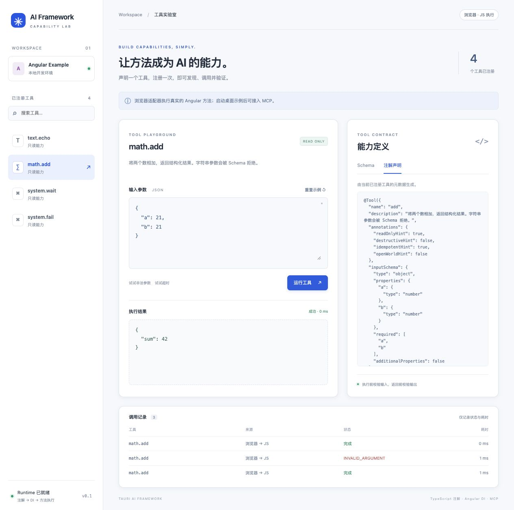
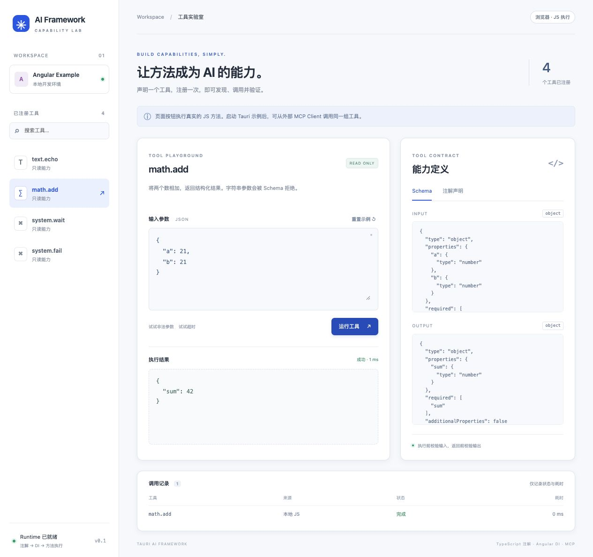
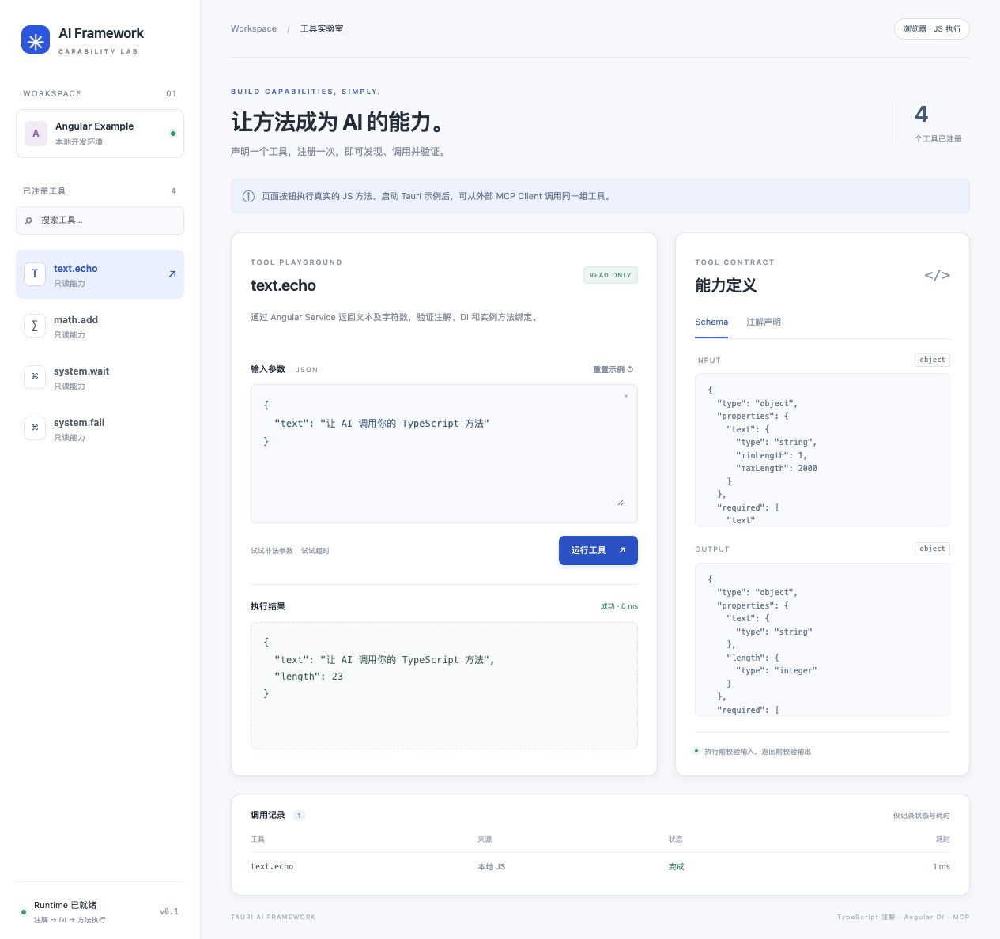

# 验收记录

日期：2026-10-05（Asia/Shanghai）。此记录区分源码测试、浏览器交互与真实桌面调用。

2026-10-06 目录调整：Angular 应用及桌面宿主统一到 `examples/tauri-app`，旧前端模板与独立示例目录已清理。迁移后重新通过 `npm run check`、`npm run example:build` 和该宿主的 `cargo check --features tauri/custom-protocol`；下文复现命令均使用当前目录。

## 2026-10-06 Tool 管线重构

本轮采用新的 ToolOptions 与内部桥接 v2，没有旧字段、旧装饰器别名或 v1 桥接兼容。Resource / Prompt、动态 Manifest / RegistryRevision、进度和严格 CSP 构建仍未实现。

| 检查 | 本轮结果 |
| --- | --- |
| `npm run check` / `npm test` | 类型检查及 22 项 SDK 测试通过；包括真实 Tauri Adapter 的官方 IPC mock、授权拒绝、starting / stop、同步迟到结果、DI useValue / useFactory、取消早于准入的竞态 |
| `cargo test --tests` | 15 项通过：1 项 IPC 入口用例、14 项 Runtime / 真实 HTTP 用例；覆盖 Caller、授权、就绪、单工具容量、归属取消、迟到成功、撤销顺序及一次终态 |
| `cargo fmt --check` / Clippy | 通过；Clippy 使用 `--all-targets -- -D warnings` |
| `npm run example:build` | SDK ESM / CommonJS / 声明及 Angular 生产构建通过；显式 DI Provider，TextTools 使用工厂 |
| 浏览器交互 | 注册 4 个工具，math.add 返回 `{"sum":42}`；非法参数返回 INVALID_ARGUMENT，并进入调用记录 |
| macOS 桌面 + `scripts/verify-mcp.mjs` | 使用既有 `.env.local` 固定凭据启动；真实工具发现、认证、Origin、并发方法调用、参数拒绝、业务错误和超时通过 |
| MCP 错误分类 | 未知 Tool 返回 -32602 / NOT_FOUND；HTTP 回归同时证明已知 Tool 的业务 NOT_FOUND 仍返回 isError 工具结果 |
| MCP 元数据 | 四项 ToolAnnotations 正确发布；框架 policy 不作为 MCP 字段发布 |

桌面链路为 `MCP → Rust 管线 → Tauri Channel → JS Executor → Angular DI 方法 → Rust 终态 → MCP`。应用内入口为 `AiRuntime.invoke → Tauri IPC → 同一 Rust 管线`，由 SDK Adapter mock 与 Rust IPC 入口用例验证；本轮没有声称完成原生窗口按钮的端到端自动化。

Rust 使用单调时钟检查终态；同步 JS 或测试 Executor 阻塞后回传成功，也无法延长有效预算。进入 Rust 后的派发前拒绝通过 Channel 形成 RuntimeEvent；事件订阅不保存参数或返回正文。纯浏览器采用独立 Adapter，不提供 MCP 服务。



## 2026-10-06 Yarn 安装与启动修复

在 `examples/tauri-app` 使用 Yarn 4.18.0 复现 `YN0016: @angular/build@21.2.25 … quarantined`。本机生效的 `npmMinimalAgeGate` 为 1440 分钟；官方 registry 显示该构建包发布于 2026-10-05 17:24（Asia/Shanghai），报错时未满 24 小时。这属于 [Yarn 依赖冷却期](https://yarnpkg.com/configuration/yarnrc#npmMinimalAgeGate) 拒绝解析该新版本。

修复将 CLI / build 固定为 21.2.24，保留 Angular 运行时 / compiler-cli 21.2.25；同时将 Piscina 覆盖为 5.3.2，包含 [GHSA-67c8-pqhq-4rmx 修复](https://github.com/advisories/GHSA-67c8-pqhq-4rmx)。这组依赖曾在 1440 分钟门限下安装通过。工作期间 `.yarnrc.yml` 另有更新，当前包括 `npmMinimalAgeGate: 0` 和 `enableScripts: true`；这些新增设置已保留，最后复验使用当前配置。

继续安装还复现了 Yarn `file:../..` 复制插件根目录及 5.8 GB Rust 缓存导致的内存不足。项目改用 `node-modules` 和 `portal` 直接链接本地 SDK，启动 / 构建脚本自动先生成 SDK 产物，并保存根目录 Yarn 4 锁文件。npm 的锁文件独立生成；如果交替安装后 Yarn 锁文件被 npm 改写，先重新执行 `yarn install`。

当前通过的复验：

| 检查 | 结果 |
| --- | --- |
| 示例目录 `yarn install` / `yarn install --immutable` | 通过；两个上游可选 WASM peer 提示，不影响本机运行 |
| `yarn check`、`yarn test` | 类型检查通过，SDK 12 / 12 测试通过 |
| `yarn workspace tauri-plugin-ai-example build` | SDK 与 Angular 生产构建通过 |
| npm 锁文件检查与 `npm audit --package-lock-only --audit-level=high` | Piscina 5.3.2，0 个报告漏洞 |
| `yarn start` 的浏览器服务 | 页面注册 4 个工具，`math.add` 返回 `{"sum":42}` |
| `yarn tauri dev --no-watch --config '{"build":{"beforeDevCommand":""}}'` | 复用已运行的 Angular 服务，桌面编译并启动成功 |
| `node scripts/verify-mcp.mjs …` | 真实 MCP → Rust → Angular 链路全部通过，包含认证、Origin、并发、参数校验、错误和超时 |

桌面启动复验使用 macOS、Node.js 22.19.0 和 Yarn 4.18.0；复用了插件根目录的 Cargo `target`。该次复验核对了 Codex CLI 0.154.0 的 `mcp add --help` 并补入接入说明；后续用户配置检查见下文。



## 2026-10-06 固定令牌启动

示例的 `tauri` 脚本使用 Node.js `--env-file-if-exists=.env.local` 加载本机配置，再通过 `tauri.mjs` 调用官方 CLI。Rust 宿主原有的 `AI_MCP_TOKEN` / `AI_MCP_PORT` 读取方式保持一致，直接 `cargo run` 不加载该文件。

本机 `.env.local` 复用了当前运行实例的令牌及端口；没有重新生成凭据，文件权限为 `0600`，已被 Git 忽略。提交的 `.env.local.example` 只提供配置键和填写说明。

验证通过：

- `yarn tauri --help`、`npm run tauri -- --version` 正常转发至 Tauri CLI 2.12.1。
- 使用新启动脚本重启真实桌面进程，连接文件中的 Authorization 与保存的令牌一致，端口也一致。
- 真实 MCP 验收脚本全部通过，覆盖工具发现、认证、Origin、调用、并发、非法参数、业务错误及超时。
- 对 Angular 开发服务请求 `/.env.local`，响应未包含本机令牌。

## 2026-10-06 Codex 本机配置

根据用户授权，在本机 `~/.codex/config.toml` 新增 `mcp_servers.tauri_ai`，使用 `http://127.0.0.1:38473/mcp` 和 `.env.local` 中既有固定令牌的静态 Authorization header。写入前备份，保留其余配置，配置与备份文件权限为 `0600`；凭据未写入仓库文档。

`codex mcp get tauri_ai --json` 成功读取启用的 `streamable_http` 服务，地址及 header 与运行实例匹配。用该命令返回的连接配置执行 `scripts/verify-mcp.mjs`，工具发现、认证、Origin、并发、参数校验、业务错误和超时检查全部通过，`math.add` 返回 `{"sum":42}`。

首次检查时，既有实例的 `system.wait(30 ms)` 在约 1500 ms 返回 `TIMEOUT`，同步工具正常。示例宿主新增 `backgroundThrottling: "disabled"` 并重启后，完整检查通过。该设置按 [Tauri 官方配置](https://v2.tauri.app/reference/config/#backgroundthrottling) 关闭支持平台的后台调度限制；本次未做长时间后台停留或跨平台验收。

以上验证覆盖 Codex CLI 配置读取及使用该配置的真实 MCP 请求。Codex 产品端的模型调用尚待用户在 MCP 设置重启服务后测试，不能将 HTTP 验收等同于产品端调用验收。

## 环境

- macOS 本机；Node.js 22.19.0，Rust 1.99.0 stable。
- Angular 21.2.25，TypeScript 5.9，Tauri 2.12.1，rmcp 3.5.0。
- 浏览器：Codex 内置浏览器；桌面：Tauri 原生 WebView。
- MCP 实测协议版本：`2025-11-25`，Streamable HTTP，使用仓库中的 Node HTTP 验收脚本。

## 自动化结果

| 检查 | 结果 | 范围 |
| --- | --- | --- |
| `npm run check` | 通过 | TS Core 与适配接口类型检查 |
| `npm test` | 12 / 12 通过 | 实例绑定、原子注册、校验、异常、超时、取消、重启、权限、重复派发、容量、连接重试及非法元数据 |
| `npm run example:build` | 通过，无构建警告 | SDK Rollup 产物及 Angular 生产构建 |
| ESM / CommonJS 入口检查 | 通过 | 根入口、`/tauri`、`/angular` 均能加载，构建后的 Runtime 能执行工具 |
| `cargo test --tests` | 9 / 9 通过 | 来源/会话隔离、校验、一次完成、取消、超时、重连、容量、派发与注销顺序、真实 HTTP 协议 |
| `cargo clippy --all-targets -- -D warnings` | 通过 | 插件 Rust 实现及测试 |
| 示例 `cargo clippy` 与格式检查 | 通过 | Angular 桌面宿主 |

Rust HTTP 测试使用内存桥接回调，不代表已运行 Angular。下面的桌面验收单独证明真实 IPC 链路。

## 浏览器交互

实测地址：`http://127.0.0.1:1420`。

- 启动后发现 4 个通过注解注册的工具，页面标记「浏览器 · JS 执行」。
- `text.echo` 调用 Angular TextService，返回原文及字符数；默认示例字符数为 23。
- `math.add` 返回 `{"sum":42}`。
- 非法参数显示 `INVALID_ARGUMENT`；`system.fail` 显示 `DEMO_ERROR`。
- 等待 5000 ms 的请求在约 1500 ms 显示 `TIMEOUT`。
- 执行中点击取消显示 `CANCELLED`，记录状态同步更新。
- 「注解声明」显示从真实注册元数据生成的声明；Schema 页展示输入、输出约束。
- 最终页面检查未发现浏览器 console error / warning。



## 桌面 MCP 完整链路

分别使用开发服务和嵌入的 Angular 生产资源启动桌面应用，并执行：

```sh
node scripts/verify-mcp.mjs "$HOME/Library/Application Support/com.tauri.ai.framework.example/mcp-connection.json"
```

生产资源加载方式（先完成 `npm run example:build`，并关闭占用同一 MCP 端口的旧实例）：

```sh
cargo run --manifest-path examples/tauri-app/src-tauri/Cargo.toml \
  --target-dir target --features tauri/custom-protocol
```

通过的检查：

| 请求 | 实际结果 |
| --- | --- |
| 无认证请求 | HTTP 401 |
| 带不允许的 Origin | HTTP 403 |
| initialize | 协商 `2025-11-25` |
| tools/list | `math.add`、`system.fail`、`system.wait`、`text.echo` |
| text.echo | `{"text":"来自 MCP 的真实调用","length":12}` |
| 并发 math.add / system.wait | `{"sum":42}` / `{"waitedMs":30}`，请求结果正确关联 |
| math.add 非法参数 | 工具错误 `INVALID_ARGUMENT` |
| system.fail | 工具错误 `DEMO_ERROR` |
| system.wait 超时 | 工具错误 `TIMEOUT`，`details.outcome` 为 `unknown` |

实际链路为 `HTTP MCP → Rust Runtime → Tauri Channel → JS AiRuntime → Angular DI 实例方法 → IPC 返回 → MCP structuredContent`。脚本只输出工具结果和验证结论，不输出连接凭据。

## 尚未验收与限制

- 未在 Windows / Linux 或移动端运行；未使用具体第三方 MCP 产品进行兼容性验收。
- MCP 其他协议版本虽可能由 rmcp 支持，但不列为本项目已验证兼容版本。
- 桌面取消与卸载的故障注入覆盖来自 SDK / Rust 测试；未声称完成 WebView 崩溃或所有系统退出场景的端到端验收。
- 当前 Ajv 运行时校验需要 CSP 允许 `unsafe-eval`；构建期校验器生成尚未实现。
- 没有模型对话、OAuth、多用户身份、持久化工具结果或业务写入回滚。
