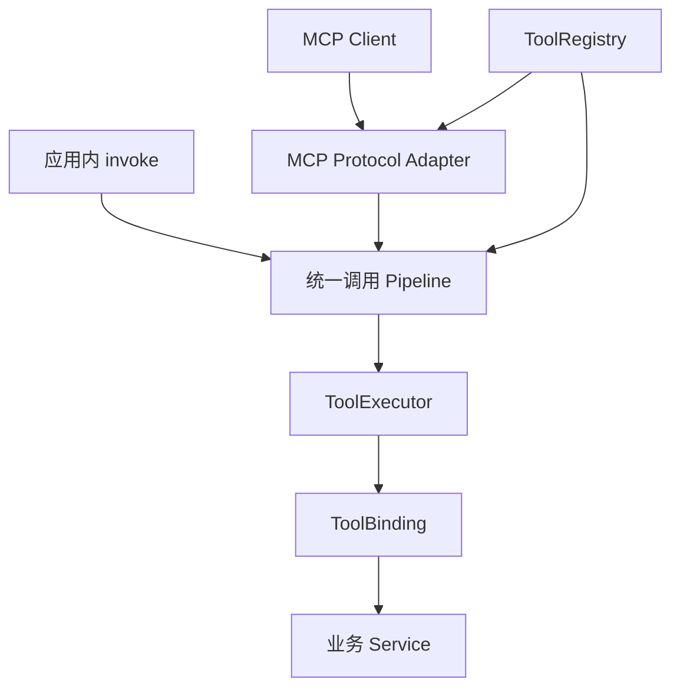

# Tauri MCP 服务框架设计与 Tool 规范

更新：2026-10-07。本文取代初稿中以窗口路由为中心的设计。第 1–11 章记录本轮 Tool 重构后的实现；第 12–20 章保留完整框架目标，其中 annotations / policy、Caller、统一 Tool 管线、就绪和调用事件已落地。Resource、Prompt、动态注册版本、进度与构建工具仍是后续设计，13.6 单独标明装饰器的实现状态。现有 API 的使用方式见 [README](../README.md)，实测范围见 [验收记录](verification.md)，领域术语见 [CONTEXT](../CONTEXT.md)，下一版职责见 [JS 与 Rust 能力划分](runtime-responsibilities.md)。

当前已验收 MCP 协议版本为 `2025-11-25`，内部桥接版本为 `2`。依赖库支持的版本、参考资料的最新版本和本项目已验收的版本分别记录。

## 1. 产品定位

本项目定位为 Tauri 应用级 MCP 服务框架，负责业务能力的声明、发现、授权、执行和调用结果管理。当前通过 JavaScript / TypeScript 方法实现 Tool，以 Tauri 2 插件承载 Rust 运行时，以 MCP 提供外部入口。模型推理、聊天和业务工作流可以作为独立上层模块接入。

业务开发者只需：

1. 用 `@Module` 和 `@Tool` 描述方法的用途、输入和输出。
2. 在应用启动时注册由 DI 创建的实例。
3. 在方法中调用已有 Service，并按需响应取消信号。

新增工具不增加 Rust 业务命令。公开接口不包含 windowId、owner、active-window、document scope 或窗口选主。使用一个应用级 JS ExecutionHost，由 Rust 管理桌面 Runtime。

## 2. 执行链路和职责

```text
外部 MCP Client
   │ tools/list / tools/call
   ▼
Rust MCP Adapter ── 本机认证、协议兼容
   ▼
Rust CapabilityRuntime ← 应用内 invoke（IPC）
   │ 注册、就绪、Caller、授权、准入、截止时间、终态
   │ Tauri Channel / plugin command
   ▼
JS Executor ── 实例绑定、业务检查、协作取消、结果规范化
   ▼
普通方法 / Angular Service
```

| Module | Interface 的职责 |
| --- | --- |
| Rust Runtime | 管理一个桥接会话，发布已注册的工具，调度调用并完成一次响应 |
| Tauri Bridge | 从宿主确认 IPC 来源，发送调用、状态和取消，接受结果；业务调用不传路由标识 |
| MCP Adapter | 映射工具描述、结构化输出与错误；复用官方 Rust SDK |
| TS Core | 装饰器、defineTool、实例注册、JSON Schema 校验、调用上下文和本地调试 |
| Angular Adapter | 获取 DI 实例，在初始化时启动 Runtime，在销毁时释放 |
| 示例应用 | 展示工具列表、描述、Schema、输入、结果和执行状态 |

JS 函数保留在 JS 内存中；跨 IPC 传递的是声明与 JSON 数据。SDK 核心不依赖 Angular，Angular 适配通过独立导出入口提供。包提供 ESM / CommonJS 与类型声明，三个入口为包根、`/tauri` 和 `/angular`。

## 3. 工程结构

沿用已经初始化的 Tauri 插件结构，不另起多 crate 工作区：

```text
src/
  runtime.rs          统一授权、准入、预算、终态与桥接生命周期
  registry.rs         声明及 Schema 校验
  commands.rs         Tauri 登记、就绪、调用、取消、回传和释放
  mcp.rs              MCP HTTP 入口
  models.rs           桥接数据结构
guest-js/
  decorators.ts       注解和实例绑定
  runtime.ts          SDK Facade 与生命周期
  registry.ts         本地声明与方法绑定
  executor.ts         执行业务方法与协作取消
  browser.ts          独立浏览器调试 Adapter
  tauri.ts            Tauri Transport
  angular.ts          Angular provider
  types.ts            公共类型
examples/tauri-app/
  src/                Angular 工具实验室
  src-tauri/          桌面宿主
docs/
  mcp-framework-design.md
```

按 Tauri 插件规范使用 `tauri-plugin-mcp` 和 `tauri-plugin-mcp-api` 的包名。`examples/tauri-app` 是统一的 Angular 示例，包含工具实验室与 Tauri 桌面宿主。

## 4. 业务接入

使用显式 JSON Schema 作为跨语言约定，首版输入和输出均为 JSON object。首版使用 TypeScript legacy decorators（`experimentalDecorators: true`），匹配 Angular 的编译方式。两端使用 JSON Schema 2020-12，仅接受本地引用，并关闭 `format` 断言；SDK 不执行类型转换、默认值填充或额外属性删除。

JS 校验器采用 Ajv 运行时编译，宿主 CSP 需要允许 `script-src 'unsafe-eval'`。示例已显式配置；要求禁止动态求值的宿主尚不能直接接入。后续应增加构建期生成校验器的路径，并使用同一组 Schema 用例检查 Rust / JS 一致性。

```ts
import { Injectable } from '@angular/core'
import { Module, Tool } from 'tauri-plugin-mcp-api'

@Injectable()
@Module('text')
export class TextTools {
  @Tool({
    name: 'echo',
    description: '返回输入的文本',
    inputSchema: {
      type: 'object',
      properties: { text: { type: 'string', minLength: 1 } },
      required: ['text'],
      additionalProperties: false,
    },
    outputSchema: {
      type: 'object',
      properties: { text: { type: 'string' } },
      required: ['text'],
      additionalProperties: false,
    },
    annotations: { readOnlyHint: true, destructiveHint: false, idempotentHint: true, openWorldHint: false },
  })
  echo(input: { text: string }) {
    return { text: input.text }
  }
}
```

`text.echo` 是完整工具名称。注解只记录声明，不创建业务实例，也不在 import 时开启连接。

```ts
import { provideMcpRuntime } from 'tauri-plugin-mcp-api/angular'
import { TauriTransport } from 'tauri-plugin-mcp-api/tauri'

bootstrapApplication(AppComponent, {
  providers: [
    TextTools,
    provideMcpRuntime({
      modules: [TextTools],
      transport: new TauriTransport(),
    }),
  ],
})
```

非 Angular 场景使用 `new McpRuntime()`、`registerModule(instance)` 或 `register(defineTool(...))`。工具注册在启动前完成；运行中修改工具集需要停止后重新启动，避免首版引入动态注册与缓存同步协议。

## 5. 两种示例运行方式

| 方式 | 实际执行 | 可验证内容 |
| --- | --- | --- |
| 浏览器 | 注解 → DI 实例 → JS Runtime → 真实方法 | 注册、Schema、方法绑定、结果、错误、超时与取消 |
| Tauri 桌面 | 同一 Angular 应用建立桥接；外部 MCP → Rust → JS 方法 | 加上 IPC、Rust 校验、MCP HTTP、凭据与来源校验 |

页面按钮调用 `McpRuntime.invoke()`；桌面模式通过 IPC 进入 Rust，source 为 local，外部 MCP source 为 mcp。纯浏览器使用 Browser Adapter。运行模式在界面中明确显示。只有真实 MCP Client 对桌面进程发起的调用才能作为端到端 MCP 验收证据。

示例包含文本回显、数字求和、可取消等待与受控错误。使用普通的 Angular Service，展示依赖注入和真实方法执行。默认状态存在内存中，刷新重置。

## 6. Runtime 与桥接生命周期

公共生命周期：`register → start → invoke → stop`。相同实例重复 start 不应创建多个连接；stop 取消本地在途调用并注销桥接。重新 start 可以恢复连接。

内部桥接协议 v2（旧版本拒绝）：

| 操作 | 方向 | 内容 |
| --- | --- | --- |
| runtime_connect | JS → Rust | protocolVersion、完整 definitions、接收 Channel |
| connect 返回 | Rust → JS | Rust 分配的 sessionId |
| runtime_ready | JS → Rust | sessionId；确认绑定就绪，返回已接受目录与 pendingCount |
| runtime_invoke | JS → Rust | sessionId、requestId、name、arguments；身份由入口生成 |
| call | Rust → JS | sessionId、requestId、name、arguments、deadline、caller |
| runtime_resolve | JS → Rust | sessionId、requestId、成功结果或结构化错误 |
| runtime_cancel | JS → Rust | requestId；Rust 检查 Caller 归属 |
| cancel | Rust → JS | sessionId、requestId、结构化 error |
| state | Rust → JS | sessionId、RuntimeEvent、pendingCount；含派发前拒绝 |
| runtime_disconnect | JS → Rust | sessionId |

IPC 来源由 Rust 从调用上下文确认，JS 无须传入窗口标识。sessionId 仅为内部代际隔离，不是外部凭据。新会话取代同一来源的旧会话，旧结果不允许完成新请求；另一个来源不能抢占正在运行的 Runtime。

注册采用全量校验后原子替换：重复工具名、非法 Schema、超出上限或协议不匹配都拒绝整批提交。登记与就绪分别确认；Rust 接受 ready 后才允许调用，目录再按 Caller 的 Authorizer 检查过滤。

承载 JS 环境销毁时撤销内部注册；这属于桥接资源释放，不构成窗口业务模型。

## 7. 调用约定

默认超时 30 秒，工具可声明 1–300000 毫秒。最多注册 128 个工具、同时执行 64 个请求；整批声明和单次输入、输出受 1 MiB 上限限制，JS JSON 嵌套深度最多 64。首版满载立即返回 BUSY，不提供无界队列。

调用顺序：

1. 外部入口验证凭据与请求来源。
2. 查找已就绪的工具，生成可信 Caller，检查 Host Authorizer、输入和容量。
3. 建立 requestId、截止时间和取消上下文，派发到 SDK。
4. JS Executor 执行业务附加检查及绑定方法，校验并返回 JSON 输出。
5. Rust 使用单调时钟复查截止时间与输出，裁决一次终态，释放 pending 并发布事件。

JS 方法可以接受第二个参数 `ToolContext`，包含 requestId、source、caller、deadline 和 AbortSignal。框架不将客户端自行声明的 clientInfo 作为可信业务身份。

错误使用稳定的 code、message 和可选 details。至少区分 INVALID_ARGUMENT、INVALID_RESULT、NOT_FOUND、NOT_READY、BUSY、TIMEOUT、CANCELLED、HANDLER_ERROR、UNAUTHORIZED 和 STALE_SESSION。

每次调用最多完成一次响应。超时或取消不会自动重试方法，也不能证明业务副作用已经撤销。写操作的幂等和最终状态查询由方法所调用的业务服务提供。同步阻塞 JS 的方法无法被 AbortSignal 强制中止，应由业务方避免。

## 8. 权限与扩展

首版的 MCP HTTP 默认关闭，由宿主 Rust 显式启用；只监听 127.0.0.1，使用宿主提供的 Bearer 凭据，拒绝不允许的 Origin，限制请求大小。凭据不进入工具参数、前端工具元数据或调用日志。

本机可信客户端接入尚未实现 OAuth 或多用户账号。policy.permissions 由 Rust Host Authorizer 检查；非空要求而无 Authorizer 时拒绝执行，并从对应 Caller 的目录隐藏。JS beforeCall 只追加业务检查。annotations.readOnlyHint 等字段用于描述行为，不授予权限。宿主可通过 RuntimeConfig 收紧预算和全局并发，policy.maxConcurrency 限制单工具并发。

Tauri 的注册/回传命令使用独立插件权限，与外部 MCP 认证分别控制。

审计事件默认只含请求编号、工具名、来源、状态、耗时与错误码；示例结果面板可展示用户主动调用的结果。不要默认将参数正文、密钥或完整返回值写入日志。

## 9. MCP 映射

复用官方 `rmcp` 的 Streamable HTTP 实现，不自行拼装一套相似协议。首版提供 tools/list 和 tools/call，inputSchema、outputSchema 和四项 ToolAnnotations 来自声明；policy 不发布为 MCP annotations。结果映射 structuredContent，并保留兼容文本内容。

协议不合法、方法不存在等由 MCP SDK 处理；未知 Tool 映射 JSON-RPC invalid params，执行与参数校验失败映射工具错误结果。运行时取消映射到 JS AbortSignal。长任务、Resources、Prompts、订阅式列表变化和 stdio 桥接不作为首版要求。

依赖 SDK 支持的协议版本必须通过真实客户端验证后才能列为本项目已验收兼容版本；引用官方规范不等于完成兼容验收。

## 10. 示例交互

主界面是工具实验室：

- 顶部显示运行模式、Runtime 状态和已注册工具数量。
- 左侧是按模块组织的工具列表。
- 中间展示选中工具说明、JSON 输入、执行与取消按钮。
- 执行面板展示结构化结果；右侧展示输入输出 Schema 和由真实元数据生成的注解代码。
- 底部显示近期调用摘要，区分本地调用与 MCP 派发。

提供合法输入、非法输入、超时与取消的可重复操作。页面显示错误码和明确结果，不把失败渲染成成功。结果面板只显示页面主动发起的调用；调用记录不保存参数或返回内容，订阅 Rust 的调用事件，包括派发前拒绝。纯浏览器订阅 Browser Adapter 的对应事件。

## 11. 验收

| 场景 | 预期 |
| --- | --- |
| 注解注册多个模块 | 名称和 Schema 一致，方法 this 保持原 DI 实例 |
| 重复名称 / 非法定义 | 拒绝注册，不出现半批可用工具 |
| 正常调用 | 返回真实业务方法产生的数据 |
| 输入不合法 | Handler 不执行，返回 INVALID_ARGUMENT |
| 输出不合法 | 返回 INVALID_RESULT，不向外传播错误结构 |
| 方法抛错 | 返回稳定错误，不泄漏内部堆栈 |
| 超时 / 主动取消 | 终止等待、发送取消信号，迟到结果不会二次完成 |
| 停止 / 重启 | 在途请求结束，旧会话结果无法污染新会话 |
| 超出在途上限 | 立即返回 BUSY |
| MCP 无凭据 / 非法 Origin | HTTP 拒绝，Handler 不执行 |
| MCP 真实调用 Angular | 通过 tools/list 发现，tools/call 返回注解方法的真实结果 |

自动化检查覆盖公开接口与跨层协议；浏览器效果、Rust 测试和真实桌面 MCP 调用分别记录。复现命令与当前结果见 [验收记录](verification.md)。

## 12. 应用级服务职责（下一版草案）

以下第 12–20 章定义完整框架目标；本轮已实现的 Tool 基础链路以第 1–11 章及职责文档第 8 节为准，其余扩展未实现。JS 提供业务能力 SDK 和方法执行宿主，Rust 提供应用级 MCP 服务与统一运行时；具体职责、共享契约、就绪链路和当前代码差异见 [JS 与 Rust 能力划分](runtime-responsibilities.md)。

服务生命周期由 Tauri 宿主持有。业务模块提供 ToolDescriptor 和 ToolBinding；框架承担 ToolCatalog、Caller 认证、调用授权、执行预算、结果裁决与 MCP 映射。执行宿主的可用性作为内部运行状态，业务声明中不加入窗口身份。



在 Tauri 模式下，外部 MCP 调用与应用内 `invoke` 进入同一 Rust 调用 Pipeline，入口认证方式可以不同，输入输出校验、权限规则、取消、错误与审计约定保持一致。JS SDK 绑定实例并执行方法，Rust Runtime 对调用终态负责。纯浏览器模式继续作为独立调试适配，按共享用例验证行为。

| 框架承担 | 业务模块承担 |
| --- | --- |
| 标准描述、注册、发现和协议映射 | 工具用途、输入输出和行为声明 |
| Caller 认证、宿主授权接口和执行预算 | 业务资源授权、事务、幂等与最终状态查询 |
| 校验、派发、取消、一次结果裁决 | 响应 AbortSignal、返回约定结果、抛出受控业务错误 |
| 服务状态、调用事件和限额 | 已有 Service 的业务逻辑及其 DI 配置 |

Tools 是首个完整能力模块。Resources、Prompts、富内容结果与原生 Rust ToolExecutor 作为独立扩展逐步加入，各自遵循 MCP 对应协议；只声明实际实现的协议 capability。支持 `tools/list` 的服务在暂时没有可用工具时可以返回空列表。

## 13. Tool 声明规范（下一版草案）

### 13.1 描述、策略和绑定分别维护

| 层次 | 内容 | 对外映射 |
| --- | --- | --- |
| ToolDescriptor | name、title、description、inputSchema、outputSchema、annotations；可选 icons | 使用 MCP 标准字段 |
| ToolPolicy | permissions、timeoutMs、maxConcurrency 等实际执行规则 | 保留在框架内部，不混入 MCP annotations |
| ToolBinding | 方法、DI 实例、校验器与所属 ToolRegistration | 方法和实例不跨 IPC 序列化 |
| 注册元数据 | 模块、ToolContractVersion、Schema 摘要、执行宿主就绪状态 | 默认用于内部管理；确需导出时采用合规的 `_meta` 命名空间 |

MCP 的 `execution` 字段有独立协议含义，不用于存放本框架的超时和并发配置。字段映射依据 [MCP Tool Schema](https://modelcontextprotocol.io/specification/2025-11-25/schema#tool)。

### 13.2 命名与用途描述

- 外部名称由模块命名空间与显式 Tool 别名组成，例如 `document.get`、`document.search`、`document.update`。重构类名、方法名或文件路径不改变已发布的名称。
- 名称满足 MCP 的 ASCII 字符与 128 字符上限。新工具建议采用 `namespace.lower_snake_case`；风格检查与协议合法性检查分别处理，保留现有名称兼容性。
- `title` 用于人类阅读，`description` 用于说明何时调用、执行什么操作、返回哪些数据，以及重要前置条件和副作用。
- 一个 Tool 应有清晰的业务意图和可独立授权的粒度。描述中的使用提示不成为授权规则。
- 框架必须检查名称唯一、描述非空和数据契约合法。描述质量通过业务示例与评审检查，不能仅凭字符串长度判定。

### 13.3 输入输出数据约定

首个框架版本继续以 JSON Schema 2020-12 的 object 输入和结构化 object 输出为标准路径。框架要求结构化工具声明 inputSchema 与 outputSchema，这比 MCP 对 outputSchema 的可选要求更严格。

- 输入字段描述用途；明确 required、enum、长度、范围和可空性。固定 DTO 默认 `additionalProperties: false`，字典或扩展对象明确声明允许的数据结构。
- 输入显式携带业务所需标识，不隐式依赖某个当前业务对象。
- Schema 中的 `default` 仅作声明，业务方法负责落实缺省行为；框架不自动转换类型、填默认值或删除字段。
- 标识符和可能超过 JS 安全整数范围的数据采用明确的字符串表示；时间格式、单位、金额精度等由业务契约说明。
- 列表工具明确分页、排序、数量上限与后续游标。业务分页游标与 `tools/list` 的协议分页游标分别维护。
- 显式 Schema 是数据契约的事实来源。构建工具生成或推导 DTO 类型与校验器，避免依靠运行时读取已被擦除的 TS 参数类型。
- Rust 与 JS 使用共享 Schema 用例。当前本地引用、format 不作断言的行为保持明确；扩展 dialect 或 format 时，两端必须同时支持并验证。

严格 CSP 的发布路径预编译 JS 校验器并生成 Manifest。采集声明时不能实例化 Angular Service 或启动应用；动态 Schema 可以使用开发模式编译路径，严格 CSP 构建需要可预编译的声明。

### 13.4 行为提示与实际执行策略

行为提示采用 MCP 字段：`readOnlyHint`、`destructiveHint`、`idempotentHint`、`openWorldHint`。新 Tool 声明要求显式填写，避免开发者无意依赖缺省提示。这是框架约定，不是 MCP 的字段必填要求。

这些字段均是提示。它们不授予权限，不证明业务实现幂等，也不自动触发重试；含义与缺省值见 [MCP ToolAnnotations](https://modelcontextprotocol.io/specification/2025-11-25/schema#toolannotations)。

ToolPolicy 的基本规则：

- `permissions` 声明所需业务权限，宿主 Authorizer 执行检查；非空声明而未安装对应 Authorizer 时拒绝执行。空数组仍接受宿主基准访问规则。
- `timeoutMs` 声明工具时间预算；有效预算不能超过宿主上限。接受结果前再次检查截止时间。
- `maxConcurrency` 限制单工具在途调用，结合全局与 Caller 限额执行。默认满载返回 BUSY；启用队列时必须同时规定容量、排队预算和取消规则。
- 宿主策略可以收紧 ToolPolicy，Tool 注解不能提升 Caller 权限或放宽宿主限制。
- 业务写入需要幂等时，明确逻辑操作标识及服务端保障；框架 requestId 只标识一次调用尝试。
- 默认不自动重试。即使声明幂等，重试仍需要明确策略和对未知业务结果的处理约定。

### 13.5 拟议注解示例

下面是下一版字段示例，当前 SDK 尚不接受其中的 title、annotations、policy 与 FrameworkToolContext 类型。

```ts
const GetDocumentInput = {
  type: 'object',
  properties: {
    id: { type: 'string', minLength: 1, maxLength: 128, description: '文档标识' },
  },
  required: ['id'],
  additionalProperties: false,
} as const

const DocumentSummaryOutput = {
  type: 'object',
  properties: {
    id: { type: 'string', description: '文档标识' },
    title: { type: 'string', description: '文档标题' },
    revision: { type: 'integer', minimum: 0, maximum: 9007199254740991, description: '文档修订号' },
  },
  required: ['id', 'title', 'revision'],
  additionalProperties: false,
} as const

@Injectable()
@Module('document')
class DocumentTools {
  constructor(private readonly documents: DocumentService) {}

  @Tool({
    name: 'get',
    title: '读取文档摘要',
    description: '按文档标识读取标题与修订号。适用于确认文档基本信息；不返回正文。',
    inputSchema: GetDocumentInput,
    outputSchema: DocumentSummaryOutput,
    annotations: {
      readOnlyHint: true,
      destructiveHint: false,
      idempotentHint: true,
      openWorldHint: false,
    },
    policy: {
      permissions: ['document:read'],
      timeoutMs: 10_000,
      maxConcurrency: 4,
    },
  })
  get(input: { id: string }, context: FrameworkToolContext) {
    return this.documents.getSummary(input.id, {
      callerId: context.caller.principalId,
      signal: context.signal,
    })
  }
}
```

普通方法返回业务 DTO，SDK 与协议适配器负责规范化结果。业务 Provider 由宿主配置，Angular Adapter 获取已配置的实例并注册 ToolBinding。

### 13.6 前端装饰器命名约定

公开装饰器采用单个英文名词、PascalCase，与声明的领域概念对应。推荐名称集合为 `@Module`、`@Tool`、`@Resource`、`@Prompt`；这是框架的 TypeScript API 约定。

| 装饰器 | 修饰对象 | 职责 | 实现状态 |
| --- | --- | --- | --- |
| `@Module(namespace)` | 类 | 声明能力模块命名空间；当前采集 Tool，后续可容纳 Resource 与 Prompt | 已实现 |
| `@Tool(options)` | 实例方法 | 声明可调用工具及其输入输出契约；扩展行为提示与策略见 13.1–13.5 | 已实现基础字段，扩展字段为草案 |
| `@Resource(options)` | 实例方法 | 声明资源读取；固定 URI 和 URI 模板统一通过配置表达 | 下一版扩展草案 |
| `@Prompt(options)` | 实例方法 | 声明可复用提示词及其参数 | 下一版扩展草案 |

`@Resource` 拟议配置使用 `uri` 或 `uriTemplate`，两者互斥；注册时分别映射为固定资源或资源模板，并保留各自的发现与读取语义。模板的参数及展开校验属于该配置的后续完整契约。

输入输出 Schema、行为提示和 ToolPolicy 集中在 `@Tool(options)` 中声明。上下文通过方法的第二个参数传入；Angular 的 `@Injectable()` 负责实例依赖注入。`defineTool()` 和 `provideMcpRuntime()` 是普通函数。

当前 SDK 导出 `Module` 与 `Tool`，示例与文档统一采用这两个名称。`Resource` 和 `Prompt` 在实现对应的注册、协议适配与调用链路后再公开导出。

### 13.7 Resource 与 Prompt 的功能边界

Resource 发布通过 URI 读取的上下文数据，例如业务文档正文、应用说明、数据库结构、任务状态快照。数据可以由已有 Service 在读取时生成。客户端决定如何把读取结果提供给模型。MCP 的三类服务能力及其读取、调用方式见[官方 Server Concepts](https://modelcontextprotocol.io/docs/2026-07-28/learn/server-concepts)。

| 能力 | 标识与输入 | 输出 | 本项目建议用途 |
| --- | --- | --- | --- |
| Tool | 名称与符合 inputSchema 的参数 | 调用结果或业务错误 | 搜索文档、计算统计、创建任务、修改文档；也可以提供只读查询 |
| Resource | 固定 URI，或由 URI 模板展开的具体 URI | `contents` 中的文本或二进制内容 | 提供文档正文、帮助资料、业务数据快照 |
| Prompt | 名称与模板参数 | 带角色的消息模板 | 文档总结、任务分析、业务检查的指令模板 |

对外有业务操作意图、复杂筛选或计算参数时优先使用 Tool；以稳定 URI 提供可引用上下文时使用 Resource。只读属性可以属于 Tool，不能单凭是否写入来划分这两种能力。获取 Prompt 生成的是消息，模型执行由上层客户端负责。这是本项目基于协议概念的接口选择建议。

Resource 声明包含 `name`、`description`、`mimeType` 与互斥的 `uri` / `uriTemplate`；实际读取返回 `contents` 数组。每项具有 `uri`、可选 `mimeType`，以及 `text` 或 Base64 编码的 `blob`。JSON 资源使用 `application/json` 与序列化后的 `text`。下面是按 `2025-11-25` 协议形状编写的本项目示意结果；细节见[官方 Resources 规范](https://modelcontextprotocol.io/specification/2025-11-25/server/resources)。

```json
{
  "contents": [
    {
      "uri": "app://documents/doc-123/content",
      "mimeType": "text/markdown",
      "text": "# 业务设计\n文档正文……"
    }
  ]
}
```

下面两个配置对象分别用于实例方法上的 `@Resource(options)`；当前 SDK 尚未导出 `Resource`：

```ts
const applicationInfo = {
  name: 'application_info',
  uri: 'app://info',
  description: '应用用途与业务说明',
  mimeType: 'application/json',
} as const

const documentContent = {
  name: 'document_content',
  uriTemplate: 'app://documents/{id}/content',
  description: '读取指定文档的正文',
  mimeType: 'text/markdown',
} as const
```

`resources/list` 发布可列举的固定资源，`resources/templates/list` 发布模板，`resources/read` 读取具体 URI；模板无需预先枚举所有业务对象。URI 是资源身份，不自动授予文件或网络访问权限，读取时仍检查 Caller 与业务对象权限。MCP 资源的发现、读取与权限要求见[资源规范](https://modelcontextprotocol.io/specification/2025-11-25/server/resources)。

框架沿用统一的宿主生命周期、Caller 和执行预算管理，为 Tool、Resource、Prompt 分别维护注册描述、输入与输出契约、协议结果映射。Resource 的 URI 解析与模板匹配、Prompt 的参数与消息构造由各自 Adapter 处理。订阅更新、参数补全与目录变化通知各自按实现范围声明 capability，并由协议版本适配器处理版本差异。

命名借鉴 [FastMCP 的 Resource 与 Template 统一装饰器](https://gofastmcp.com/servers/resources#resource-templates)，保持 `@Resource` 一个名称。完整开源 API 对照记录在[框架调研](mcp-framework-research.md)。

## 14. 统一调用契约（下一版草案）

FrameworkToolContext 包含框架 requestId、可信 Caller、入口 source、deadline、AbortSignal 和 reportProgress。Caller 由入口认证或可信宿主身份适配产生；客户端 clientInfo 可作为诊断标签，不能成为授权身份。MCP 请求编号、内部桥接代际、Caller 和业务幂等标识分别维护。

调用 Pipeline：

1. 协议适配器检查 HTTP / JSON-RPC 结构与请求大小，完成入口认证。
2. 确认 Tool 注册、粗粒度可见性与执行宿主可用性。
3. 校验输入，执行需要业务参数的授权检查。
4. 执行 Caller 限额、全局容量与单工具并发准入。
5. 建立 ToolInvocation，捕获本次定义和 ToolBinding 的版本快照，执行宿主调用钩子并派发。
6. 处理结果、截止时间、取消和输出校验，统一裁决一个终态。
7. 输出调用事件，映射为当前协议版本的响应并释放调用资源。

框架服务状态至少区分 starting、ready、degraded、stopping、stopped；ToolProvider 的 ready 状态独立记录。服务已监听不等于业务方法可执行。连接失败或迟迟不能完成就绪握手必须有明确状态和有界启动预算。

同步阻塞方法无法被 AbortSignal 强制终止。超时结果应按截止时间裁决，CPU 密集任务的执行承载方式由业务适配决定，不能让本地调试把迟到结果当成按时成功。

### 14.1 结果与错误

结构化成功结果通过 outputSchema 校验后映射到 structuredContent，并提供兼容的文本内容。富内容结果采用显式结果构造器，支持标准 content 类型；不通过检查普通业务 DTO 是否恰好有 content 字段来猜测结果模式。

| 情况 | 对外结果 |
| --- | --- |
| HTTP 凭据缺失或无效 | 入口认证响应，Handler 不执行 |
| JSON-RPC / CallToolRequest 结构不合法 | MCP 协议错误 |
| Tool 名称不存在或对该 Caller 不可见 | MCP 协议错误，不执行 Handler |
| 已注册 Tool 的业务输入校验失败 | `isError: true` 的 ToolResult，保留可修正的字段路径和原因 |
| 业务授权拒绝、NOT_READY、BUSY、业务错误、超时或取消 | 受控 ToolResult，稳定错误码与安全消息 |

这一区分遵循 [MCP Tool 错误约定](https://modelcontextprotocol.io/specification/2025-11-25/server/tools#error-handling)。本轮已把未知 Tool 映射为协议错误，已知工具的输入校验和执行失败返回 structured_error；完整分类与扩展能力仍按各自管线补齐。

成功 DTO 与错误 DTO 分别建模。错误包含 code、message、可选安全 details，以及必要的执行结果确定性信息。默认错误结果使用 `isError: true` 和错误文本，不把错误对象直接塞进仅描述成功 DTO 的 structuredContent；如需结构化错误，必须先定义与 outputSchema 相容的结果契约并做客户端验收。

通用异常转换为 HANDLER_ERROR，保留内部诊断而不外传堆栈。业务 ToolError 在序列化前同样检查 JSON 合法性和大小。TIMEOUT 与 CANCELLED 贯穿 Rust、桥接和 JS，不以一段 reason 文本重新猜测错误码。

框架保证每次 ToolInvocation 最多裁决一次响应；这不等同于业务操作恰好执行一次。Handler 尚未派发时可以标记 outcome 为 not_started；派发后超时、取消或断链通常为 unknown，最终业务状态由业务查询工具确认。

### 14.2 进度和长任务

reportProgress 首先形成框架事件，仅在请求提供有效 progressToken 时映射为 MCP 进度通知。进度单调递增，通知有界并限流，调用结束后停止发送，规则见 [MCP Progress](https://modelcontextprotocol.io/specification/2025-11-25/basic/utilities/progress)。

进度通知不改变一次调用只有一个最终结果的约定。需要创建后查询的长任务时，引入独立任务适配；真正支持任务接口和能力协商之后才声明 taskSupport。Tools、Resources 和富内容结果各自执行大小、类型和访问检查。

## 15. 注册与服务生命周期（下一版草案）

ToolRegistration 返回可释放的注册关系，支持整批 add、replace 和 remove。变更先验证全部描述、Schema、权限规则和名称冲突，成功后原子提交 RegistryRevision；失败保留原有注册状态。

- 描述已登记与 ToolProvider 可执行分别建模。执行宿主完成就绪握手后工具才进入可发现集合。
- add / replace / remove 的已接受调用继续使用各自的定义与绑定快照。显式撤销执行宿主时取消其在途调用并标记未知业务结果。
- 一次提交只产生一个注册版本。协议适配器据此通知相应客户端；权限或可用性导致 ToolCatalog 改变时，也使相关发现结果失效。
- tools/list 使用稳定顺序。分页游标对应确定的注册快照与授权视图；快照变化时给出可重新发现的结果，不混合两个版本的页。
- JS 刷新、执行宿主断开和重新连接不导致整个 MCP 服务无声失效。已登记但暂时不可执行的 Tool 调用返回 NOT_READY；永久移除后按未知 Tool 处理。
- 服务停止时拒绝新调用，取消在途请求，在有界时间内释放监听、订阅和桥接资源，并报告最终状态。

当前发布只提供 localhost Streamable HTTP。后续 stdio 通过独立传输适配接入统一 Runtime；服务发现、端口冲突和凭据生命周期由宿主配置。凭据保持在宿主侧，开发用 `.env.local` 与生产凭据提供方式分别约定。

## 16. MCP 协议与版本兼容（下一版草案）

MCPProtocolVersion、内部桥接版本、ToolContractVersion 和 RegistryRevision 是四种不同版本，各自负责协议兼容、执行消息兼容、业务契约兼容和注册快照识别。

截至本次查阅，官方 latest 指向 `2026-07-28`：Streamable HTTP 取消协议级会话与独立 GET 流，持续变化通知改由订阅请求承载，见 [对应版本传输规范](https://modelcontextprotocol.io/specification/2026-07-28/basic/transports/streamable-http)。这不改变框架内部对执行宿主代际隔离的需求；内部桥接会话不与 MCP 会话绑定。

框架实施规则：

- 当前 `2025-11-25` 验收基线继续单独维护。新增协议版本先建立真实请求和客户端用例，再列入已验证支持矩阵。
- JSON-RPC、传输、协议协商与通知方式交给 rmcp 和版本适配；领域注册与调用执行不直接依赖某一版本的连接模型。
- 对 `2025-11-25` 的工具变化，按声明的 listChanged 能力发送通知；适配新协议时采用对应订阅机制。不能只升级版本标签而沿用旧通知链路。
- Caller 来自本次请求认证，不从连接号、MCP 会话或 clientInfo 推导业务身份。
- 不暴露尚未实现的 capability；支持的 Schema 特性、结果类型、进度、任务和订阅分别记录。

服务身份使用宿主应用提供的名称、标题与版本，框架版本单独记录，避免不同应用都仅表现为 tauri-plugin-mcp。应用服务身份不承担 Tool 名称全局唯一性的保证。

## 17. 模块职责与 Interface（下一版草案）

保持标准 Tauri 插件结构和单 crate，按真实变化原因拆内部 Module。JS 与 Rust 分工以[职责文档](runtime-responsibilities.md)为准，桌面调用的注册状态、权限、预算和终态统一由 Rust 管理。

| Module | 所属端 | Interface 与责任 |
| --- | --- | --- |
| Contracts | 共享契约 | 能力描述、策略、上下文、桥接消息及错误；中立 Schema、TS / Rust DTO 和语义用例 |
| Declaration / Binding | JS | 装饰器及函数式声明、CapabilityManifest、已有实例的 CapabilityBinding |
| SDK Facade / JS Executor | JS | 发起请求、获取运行视图、接收派发、调用绑定方法、协作取消和结果规范化 |
| Angular / Tauri Adapter | JS | DI 与应用生命周期、IPC / Channel 封装 |
| Browser Adapter | JS 调试模式 | 按共享语义在纯浏览器中执行，不替代桌面 Rust 管线 |
| Registry | Rust | Tool、Resource、模板与 Prompt 注册，原子版本快照、绑定可用性与目录 |
| Invocation Pipeline | Rust | Caller、授权、校验、准入、派发、截止时间、取消与一次终态裁决 |
| Executor Adapter | Rust → JS；原生可扩展 | 首个 Adapter 派发到 JS，后续原生执行进入相同管线 |
| MCP Adapter | Rust | 按协议版本映射发现、调用、资源读取、Prompt 获取、错误与通知 |
| Tauri Host Adapter | Rust | 宿主生命周期、可信 IPC 来源、桥接代际与资源释放 |
| Build Tooling | 开发与构建阶段 | 静态 Manifest、DTO 类型、预编译校验器与契约检查 |

面向业务开发者的 Interface 保持少量操作：声明 Tool、注册 Provider、启动、调用、读取状态、释放注册和停止。协议升级主要影响 MCP Adapter 与 Contracts；执行规则主要影响 Invocation Pipeline；业务新增工具集中在声明与 Service 绑定。

TS Core 的根入口移除模板 ping 与平台调用，平台接口集中在 `/tauri`。MCP HTTP 依赖使用可选 Cargo feature；Angular 和构建工具保持独立导出。代码生成或共享契约用例减少两端手工维护的遗漏，避免对同一套调用语义进行各自演化。

## 18. 框架与 Tool 交付标准（下一版草案）

新增 Tool 的交付资料包含用途说明、输入输出 Schema、合法与非法输入示例、行为提示、权限与执行策略，以及涉及写入时的幂等和最终状态约定。

| 验收类别 | 必须证明的行为 |
| --- | --- |
| 声明 | 名称、元数据和 Schema 合法；实例绑定正确；无半批注册 |
| 校验 | 输入拒绝不执行 Handler；结果拒绝不向外发布无效成功 DTO；Rust / JS 用例一致 |
| 授权 | 无凭据、无权限与资源授权拒绝均走对应阶段；客户端标签不能提升权限 |
| 执行 | 同步迟到结果、异步超时、主动取消、迟到回传和断链具有一致终态 |
| 生命周期 | starting 与 ready 可区分；替换、移除、刷新和旧代际结果有明确行为 |
| 发现 | 稳定 ToolCatalog；注册变化、权限变化和可用性变化可重新发现 |
| 协议 | 未知 Tool 与执行错误分别映射；协商版本、结果 Schema、进度与订阅符合所声明版本 |
| 平台与客户端 | macOS / Windows / Linux 的后台、恢复和重连；实际 MCP Client 互操作 |

构建检查分开记录源码、发布包、新宿主安装和真实客户端调用。严格 CSP 模式需要证明应用未依赖运行时动态生成校验代码。

## 19. 实施批次（下一版草案）

实施顺序与 JS / Rust 配套工作以[职责文档的实施与验收顺序](runtime-responsibilities.md#9-实施与验收顺序)为准。

| 批次 | 内容 | 完成标准 |
| --- | --- | --- |
| 1：统一 Tool 执行 | SDK Facade / Executor 分开，修正 DI 与 starting；Rust 本地入口、Caller、授权、预算和错误裁决 | 应用内与 MCP 调用共享权限、错误、超时、取消和状态用例 |
| 2：注册与运行视图 | Manifest、绑定版本、就绪握手、RegistryRevision、目录及全链路事件 | 注册变化、断开重连、旧代际回传和在途调用快照行为明确 |
| 3：Resource | JS 固定 URI / URI 模板声明与内容生成；Rust 匹配、校验、授权及协议映射 | 固定与模板读取、文本 / JSON / blob、权限、预算和取消通过验收 |
| 4：Prompt | JS 参数与消息构造；Rust 目录、参数及消息检查、协议映射 | 发现、缺参、消息内容、权限和获取预算通过验收 |
| 5：构建与扩展 | 严格 CSP、静态声明采集、协议版本矩阵、通知 / 订阅与可选原生 Executor | 每项具有实际 Adapter、真实客户端与新宿主验收，按平台记录支持范围 |

本轮已修正同步迟到结果、starting 状态、Angular useValue / useFactory 被覆盖和取消原因丢失。回归覆盖及真实桌面结果见验收记录。就绪与调用事件先随 Tool 管线落地；Manifest / RegistryRevision、动态注册与列表通知仍待后续批次。

## 20. 新版本接口采用约定（下一版草案）

模块声明统一使用 `@Module`，工具声明使用 `@Tool`；`defineTool` 与实例绑定方式继续使用。新版本直接采用新的装饰器、字段与桥接契约，不提供旧名称别名或旧字段兼容分支。第 1–11 章及 README 已采用新 Tool 字段和桥接 v2。

- 行为提示使用 annotations.readOnlyHint 等 MCP 字段，并按新声明约定显式填写。
- 业务权限使用 policy.permissions，由 Rust 宿主检查；授权结果不从注解直接产生。
- 时间预算使用 policy.timeoutMs，由 Rust 合并 Host 上限并校验有效截止时间。
- Angular 业务 Provider 显式由宿主提供。迁移指南覆盖 useValue、useFactory、已有根级 Service 和多个注解模块。
- 新桥接 DTO 使用独立版本，不支持的内部消息版本返回 PROTOCOL_MISMATCH。
- 成功结果的业务 JSON 形状尽量保留。错误映射调整涉及的 SDK、HTTP 验收脚本和客户端用例一起迁移。
- ToolContractVersion 用于契约差异检查和发布说明，默认不向工具参数注入隐藏版本字段。新增必填参数、删除输出字段或改变业务语义视为破坏性变化；闭合 outputSchema 下新增输出字段也可能破坏旧客户端校验，需要按旧 Schema 实测。

以上草案不等于已承诺所有扩展立即实现，后续按批次建立可验证的发布基线。

## 参考

- [Tauri 插件开发](https://v2.tauri.app/develop/plugins/)
- [Tauri Channel](https://v2.tauri.app/develop/calling-frontend/#channels)
- [Angular provideAppInitializer](https://angular.dev/api/core/provideAppInitializer)
- [MCP 官方 Rust SDK](https://github.com/modelcontextprotocol/rust-sdk)
- [MCP Tools：2025-11-25](https://modelcontextprotocol.io/specification/2025-11-25/server/tools)
- [MCP Resources：2025-11-25](https://modelcontextprotocol.io/specification/2025-11-25/server/resources)
- [MCP Prompts：2025-11-25](https://modelcontextprotocol.io/specification/2025-11-25/server/prompts)
- [MCP Schema：2025-11-25](https://modelcontextprotocol.io/specification/2025-11-25/schema)
- [MCP Progress：2025-11-25](https://modelcontextprotocol.io/specification/2025-11-25/basic/utilities/progress)
- [MCP Streamable HTTP：2026-07-28](https://modelcontextprotocol.io/specification/2026-07-28/basic/transports/streamable-http)
