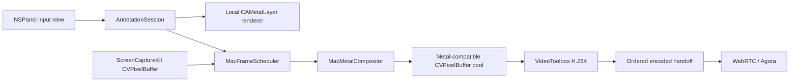

# macOS 屏幕共享标注设计

## 状态

已确认，待实施。

确认日期：2026-07-16。

## 背景

`tauri-plugin-screen-capture` 已支持 macOS 14+ 的显示器共享、单窗口共享、原生共享提示 Overlay、ScreenCaptureKit 捕获、VideoToolbox H.264 编码和 WebRTC 发布。现有共享提示 Overlay 被主动排除在采集内容之外，且初始插件设计明确未包含 annotation。

本设计为 macOS 增加直接作用于被共享显示器或窗口的屏幕标注，并保证标注烧入发送视频，使所有通过 WebRTC 或后续 Agora publisher 观看共享的接收端都能看到相同结果。

该功能面向长期生产使用，不把 CPU BGRA 合成作为正式主路径。实施同时完成 macOS 捕获到编码之间的 `CVPixelBuffer`/Metal GPU 链路，消除正常路径的整帧 CPU readback 和重复像素拷贝。

## 已确认范围

首版支持：

- macOS 14+；
- 显示器共享和单窗口共享，标注范围与共享范围一致；
- 在被共享区域上直接绘制，而不是仅在应用内预览中绘制；
- 画笔、橡皮擦、撤销、清空；
- 画笔颜色和粗细；
- 本地标注与发送画面一致；
- 窗口移动、缩放、多显示器和 Retina 坐标映射；
- 暂停、恢复、停止和共享源被动关闭的完整生命周期；
- WebRTC 发布路径；
- 为后续原生 Agora publisher 保留 macOS GPU surface 接口。

首版不支持：

- Windows、Linux 或移动端标注；
- 文本、荧光笔、直线、箭头、矩形、圆形或激光笔；
- 重做；
- 多人标注、远端标注权限或标注者身份；
- 标注保存、导出或跨共享会话恢复；
- HDR 标注合成；
- 通过 Tauri IPC 传输高频鼠标轨迹；
- 依赖 ScreenCaptureKit 直接捕获标注窗口。

## 调研依据

钉钉和腾讯会议的官方资料证明“标注共享内容”是成熟的会议产品交互，但没有公开内部渲染、合成或编码实现。因此本设计只借鉴其产品行为，不推断其专有实现。

- 钉钉会议：<https://www.dingtalk.com/meeting>
- 腾讯会议互动批注指南：<https://meeting.tencent.com/support/topic/372/index.html>

macOS 媒体架构依据 Apple 的公开接口设计：

- ScreenCaptureKit 输出 `CMSampleBuffer`，其视频图像由 IOSurface-backed `CVPixelBuffer` 承载：<https://developer.apple.com/documentation/screencapturekit/capturing-screen-content-in-macos>
- `CVMetalTextureCache` 可将 `CVPixelBuffer` 映射为 Metal texture：<https://developer.apple.com/documentation/corevideo/cvmetaltexturecache>
- VideoToolbox 直接接收 `CVImageBuffer`，并提供编码 PixelBufferPool：<https://developer.apple.com/documentation/videotoolbox/vtcompressionsession-api-collection>
- 低延迟会议编码配置：<https://developer.apple.com/documentation/videotoolbox/encoding-video-for-low-latency-conferencing>
- ScreenCaptureKit 帧附件提供 `contentRect`、`contentScale` 和 `scaleFactor` 等几何信息：<https://developer.apple.com/documentation/screencapturekit/scstreamframeinfo>

本设计与仓库已有的跨平台 GPU 媒体方案一致，并将 annotation 作为 macOS GPU processor 的一个输入：

- `docs/media-solutions/2026-07-12-cross-platform-gpu-media-pipeline-proposal.md`

## 核心决策

### 使用 GPU 后处理，不捕获原生标注窗口

原生透明 Overlay 只负责接收鼠标和提供本地反馈，继续被 ScreenCaptureKit 排除。标注的矢量状态由媒体处理链读取，并在编码前通过 Metal 合成到输出 `CVPixelBuffer`。

不让 ScreenCaptureKit 直接捕获 Overlay，原因如下：

- 单窗口共享只包含目标窗口，无法稳定依赖另一个标注窗口；
- 会破坏现有“插件 Overlay 全部排除”的安全策略；
- 容易引入递归捕获、窗口层级泄漏和并发会话串流；
- Overlay 可见性和发送画面是否包含标注会产生不可靠耦合。

### macOS 正式路径使用 Metal + CVPixelBuffer

ScreenCaptureKit callback 不再锁定 PixelBuffer 并复制为 `Vec<BGRA>`。正常路径保持原生 surface：

```text
ScreenCaptureKit CMSampleBuffer
  -> retained CVPixelBuffer
  -> latest source slot
  -> Metal source + annotation composition
  -> Metal-compatible output CVPixelBuffer
  -> VideoToolbox asynchronous H.264
  -> ordered encoded sample handoff
  -> WebRTC / Agora
```

CPU readback 只允许用于测试诊断、截图或显式软件兼容 adapter，不是生产默认路径。

### 复用一个 macOS 全尺寸 Overlay panel

当前 macOS 共享提示已使用覆盖目标区域的单个 `NSPanel`。标注功能复用该 panel，不再创建第二个全尺寸透明窗口。

panel 内包含：

- 现有绿色共享角标层；
- 透明 `CAMetalLayer` 标注层；
- 接收原生鼠标事件的 View。

标注交互关闭时，panel 保持 `ignoresMouseEvents = true`。标注交互开启时，panel 接管共享范围内的鼠标事件，底层应用不再收到这些点击和拖动。

### 标注场景是唯一权威状态

本地 Overlay 和发送视频均从同一个 `AnnotationSession` 快照渲染。不能从本地 Overlay 截图或反向读取像素作为发送标注。

## 架构



## 模块划分

### 标注领域模块

```text
src/annotation/
  mod.rs
  model.rs
  history.rs
  geometry.rs
```

职责：

- 保存交互状态、当前工具和有序标注操作；
- 管理活动笔迹、撤销、清空和 revision；
- 保存归一化坐标和归一化笔宽；
- 对输入点执行在线降采样和笔迹结束后的保形简化；
- 实施操作数和点数上限；
- 产生不可变渲染快照和 revision 通知；
- 不依赖 AppKit、Metal、ScreenCaptureKit、WebRTC 或 Tauri。

深模块 interface：

```rust
impl AnnotationSession {
    fn set_interaction_enabled(&self, enabled: bool) -> Result<AnnotationState>;
    fn set_tool(&self, tool: AnnotationTool) -> Result<AnnotationState>;
    fn undo(&self) -> Result<AnnotationState>;
    fn clear(&self) -> AnnotationState;
    fn state(&self) -> AnnotationState;
    fn snapshot(&self) -> AnnotationSnapshot;
    fn subscribe(&self) -> watch::Receiver<AnnotationRevision>;
}
```

`begin_stroke`、`append_point` 和 `end_stroke` 是原生 Overlay adapter 使用的 crate-private interface，不通过 Tauri command 暴露。

### macOS Overlay 模块

```text
src/overlay/macos/
  host.rs
  panel.rs
  annotation_view.rs
  annotation_render.rs
  window_info.rs
  events.rs
```

职责：

- 在 AppKit 主线程创建、更新和销毁 panel；
- 复用现有显示器/窗口定位、Z-order、Space 和生命周期监控；
- 根据 `interactionEnabled` 切换点击穿透；
- 将鼠标事件转换为目标内容内的归一化坐标；
- 使用同一套 Metal 笔迹 tessellation 提供本地反馈；
- 窗口移动或缩放期间隐藏并拒绝输入；
- 将 panel 保持在现有 Overlay registry 中，确保 ScreenCaptureKit 排除它。

### macOS GPU 媒体模块

```text
src/platform/macos/media/
  mod.rs
  frame.rs
  scheduler.rs
  surface.rs
  surface_pool.rs
  metal_device.rs
  metal_compositor.rs
  telemetry.rs
```

职责：

- 保存 retained `CVPixelBuffer` 和 ScreenCaptureKit 几何附件；
- 用容量一 latest slot 隔离捕获 callback 和媒体处理；
- 监听新源帧、annotation revision 和静态续帧 deadline；
- 通过固定 surface pool 管理输出 PixelBuffer；
- 用 Metal 完成缩放、letterbox、颜色规范化和标注混合；
- 缓存与 revision 和输出尺寸对应的 annotation texture；
- 输出 `MacGpuSurface` 给 publisher；
- 记录分阶段 telemetry。

### macOS VideoToolbox 编码模块

将当前内嵌在 `src/webrtc/h264_encoder.rs` 的 macOS 实现拆到聚焦文件，例如：

```text
src/webrtc/h264_encoder_macos.rs
```

职责：

- 接收 `MacGpuSurface` 中的 `CVPixelBuffer`；
- 配置硬件、实时、期望帧率、最大延迟、禁止 B 帧、码率、GOP 和 profile；
- 异步调用 `VTCompressionSessionEncodeFrame`；
- 通过 callback 有序输出 Annex-B H.264；
- 响应 WebRTC PLI/FIR 并强制下一帧 IDR；
- 只在 pause、stop、reconfigure 或 drain 时调用 `VTCompressionSessionCompleteFrames`；
- 上报实际 encoder ID、硬件标志、延迟和 pending frame 数。

## 数据模型

### 标注工具

```rust
enum AnnotationTool {
    Pen {
        color: AnnotationColor,
        width_points: f32,
    },
    Eraser {
        width_points: f32,
    },
}
```

颜色接受 `#RRGGBB` 或 `#RRGGBBAA`。画笔宽度限制在 `1..=64` logical points，橡皮擦宽度限制在 `4..=128` logical points。

### 矢量操作

```rust
struct NormalizedPoint {
    x: f32,
    y: f32,
}

enum AnnotationOperation {
    Pen(Stroke),
    Eraser(Stroke),
}

struct Stroke {
    points: Arc<[NormalizedPoint]>,
    normalized_width: f32,
    color: Option<AnnotationColor>,
}
```

坐标限制在 `0.0..=1.0`。笔宽在创建笔迹时以目标区域较短边转换为归一化值。窗口移动不会修改笔迹；窗口或输出尺寸变化会重新计算映射。

橡皮擦作为有顺序的矢量操作保存，渲染时使用 destination-out 清除此前笔迹。撤销删除最后一个完整操作，因此画笔和橡皮擦均可正确撤销。

### 原生捕获帧

```rust
struct MacCaptureFrame {
    pixel_buffer: CVPixelBuffer,
    timestamp_ns: u64,
    geometry: CaptureFrameGeometry,
    generation: u64,
}
```

`CaptureFrameGeometry` 至少包含：

- PixelBuffer 宽高；
- `contentRect`；
- `contentScale`；
- `scaleFactor`；
- 输出 content rect；
- source 到 output 的确定性变换。

输出编码尺寸在会话期间保持固定。窗口尺寸变化只更新 source/content geometry，不重建 VideoToolbox session。

## GPU 渲染

每个需要发布的新帧执行：

1. 通过 `CVMetalTextureCache` 映射最新 source PixelBuffer；
2. 从固定输出池取得空闲、Metal-compatible PixelBuffer；
3. 根据 `CaptureFrameGeometry` 绘制源内容并补 letterbox；
4. annotation revision 或输出尺寸改变时，重新生成透明 annotation texture；
5. 将 annotation texture 以 premultiplied alpha 合成到输出；
6. 在 Metal command buffer 完成后生成 `MacGpuSurface`；
7. 将 surface 交给 publisher；
8. publisher 直接把 PixelBuffer 提交给 VideoToolbox 或原生 Agora adapter。

普通视频帧不会重复 tessellate 未变化的笔迹。没有标注时 compositor 仍使用相同 GPU surface 路径，避免运行中切换媒体表示。

首版 SDR 统一为 BT.709 limited range；HDR 作为独立后续设计。

## 帧调度与背压

调度器有三个唤醒源：

- 新的完整 ScreenCaptureKit 帧；
- annotation revision 变化；
- 静态 keepalive deadline。

规则：

- ScreenCaptureKit callback 不等待 GPU、编码器或 transport；
- callback 只校验状态、retain PixelBuffer 并替换容量一 latest slot；
- 只接受带有效 image buffer 的完整帧，idle/blank/stopped 分别统计；
- 原始帧和尚未合成的请求允许 latest 覆盖；
- 标注 revision 高频变化可合并中间 revision，但完成操作的最终 revision 必须进入输出；
- Metal 输出池固定为 3 个 surface；
- 只能回收 `Ready` surface，不能覆盖 `InUse`；
- 无空闲 surface 时丢弃编码前请求并计数；
- 已提交 VideoToolbox 的帧不得覆盖；
- 已编码 H.264 access unit 必须按编码顺序交给 transport；
- transport 背压不能传回 ScreenCaptureKit callback；
- 所有队列均有固定上限，禁止无界积压。

动态节拍：

- 源内容或标注持续变化时使用目标 FPS；
- annotation revision 改变时立即安排最新 revision；
- 连续静止后复用最后一个合成 surface，以初始 5 FPS 保持 RTP；
- 静止后的第一次源变化或标注变化立即恢复目标 FPS，并请求一次 IDR；
- 如果接收端兼容性测试显示 5 FPS 会导致额外 PLI，内部策略切换为目标 FPS，不改变公开接口；
- deadline 已错过时从当前时刻重新安排，不突发补帧。

## 公开接口

### Capabilities

```ts
interface Capabilities {
  // 现有字段
  supportsAnnotations: boolean
  annotationTools: AnnotationToolKind[]
}
```

macOS 14+ 且启用 `macos-screencapturekit` feature 时返回：

```ts
supportsAnnotations: true
annotationTools: ['pen', 'eraser']
```

### JavaScript 模型

```ts
type AnnotationTool =
  | {
      kind: 'pen'
      color: string
      width: number
    }
  | {
      kind: 'eraser'
      width: number
    }

interface AnnotationState {
  interactionEnabled: boolean
  tool: AnnotationTool
  canUndo: boolean
  operationCount: number
  revision: number
  lastError?: CaptureErrorPayload | null
}
```

### JavaScript 命令

```ts
setAnnotationInteraction(
  sessionId: string,
  enabled: boolean,
): Promise<AnnotationState>

setAnnotationTool(
  sessionId: string,
  tool: AnnotationTool,
): Promise<AnnotationState>

undoAnnotation(sessionId: string): Promise<AnnotationState>

clearAnnotations(sessionId: string): Promise<AnnotationState>

getAnnotationState(sessionId: string): Promise<AnnotationState>
```

不公开笔迹点 IPC 命令。原生 View 直接写入 `AnnotationSession`。

### 交互语义

- `interactionEnabled = true`：Overlay 接管共享区域鼠标并产生标注；
- `interactionEnabled = false`：恢复点击穿透，已有标注继续在本地和发送画面显示；
- 清除标注必须显式调用 `clearAnnotations`；
- 切换工具不会自动开启交互；
- 一次鼠标按下、拖动、松开构成一个可撤销操作；
- 暂停时保留笔迹和交互开关，但隐藏 Overlay、停止输出；
- 恢复时立即输出包含完整标注的最新画面；
- 停止或源关闭时销毁标注状态；
- 每个 capture session 拥有独立 `AnnotationSession`。

### 事件

```ts
const ANNOTATION_STATE_CHANGED_EVENT =
  'screen-capture://annotation-state-changed'
```

事件仅在以下时机发送：

- 开启或关闭交互；
- 设置工具；
- 一次画笔或擦除操作结束；
- 撤销；
- 清空；
- 暂停、恢复或可恢复错误导致有效状态变化。

鼠标移动和笔迹中间点不产生 IPC 事件。

### Tauri permissions

- `allow-set-annotation-interaction`
- `allow-set-annotation-tool`
- `allow-undo-annotation`
- `allow-clear-annotations`
- `allow-get-annotation-state`

以上权限加入 `screen-capture:default`。

## 会话生命周期

启动顺序：

1. 生成 `session_id`；
2. 创建初始关闭的 `AnnotationSession`；
3. 创建 publisher、GPU compositor、scheduler 和 Overlay；
4. 启动 publisher；
5. 启动 scheduler/media queue；
6. 启动 ScreenCaptureKit；
7. 启动 Overlay；
8. 将完整 `SessionRecord` 插入 session registry；
9. 启动被动结束监控。

失败时严格逆序回滚。

`SessionRecord` 新增：

```text
annotation_session
frame_scheduler
capture_overlay
```

暂停顺序：停止接受标注输入、暂停捕获、停止调度、drain 已提交媒体、暂停 publisher、隐藏 Overlay。恢复顺序相反，并立即安排最新完整帧。停止时先从 registry 移除会话，再依次关闭输入、capture、scheduler、publisher 和 Overlay，确保任一 stop 错误不会跳过后续清理。

## 错误处理与恢复

新增错误码：

```text
AnnotationUnsupported
AnnotationInvalidOptions
AnnotationUnavailable
AnnotationLimitReached
```

异步原生/GPU/编码故障使用 `CaptureRuntimeFailed`，并在 `details` 中提供：

```json
{
  "stage": "annotationOverlay | metalCompositor | videoToolbox",
  "reason": "platform-specific diagnostic",
  "recoveryAttempt": 1
}
```

失败策略：

- Metal device、shader 或 PixelBufferPool 初始化失败：共享启动失败；
- publisher 不支持 macOS GPU surface：返回 `PublisherUnsupported`；
- 标注参数非法：命令失败并保留此前工具；
- Overlay 未准备好：开启交互失败，共享和已有标注保持不变；
- runtime Metal、Overlay 或 VideoToolbox 故障：在串行 media queue 中重建一次，保留 annotation scene；
- 重建成功：下一帧强制 IDR；
- 重建失败：停止共享并发送现有 `screen-capture://session-ended`；
- 存在本地标注时绝不绕过 compositor 发送未标注画面；
- 窗口移动期间的正常隐藏不视为故障；
- generation 过期的 capture、Metal 或 VideoToolbox callback 直接丢弃并计数。

## 资源限制

为防止长时间会议无限增长：

- 单次操作最多 8192 个采样点；
- 单会话最多 4096 个可撤销操作；
- 单会话最多 1,000,000 个简化后点；
- 输入点按距离和方向变化在线降采样；
- 笔迹结束时执行保形路径简化，保留首尾点和明显拐角；
- 达到上限后停止接受新操作，返回 `AnnotationLimitReached`；
- 共享和已有标注继续工作，清空后恢复；
- 不自动删除旧笔迹，不破坏撤销语义。

## Telemetry

`CaptureStats` 新增带 serde 默认值的兼容字段：

```text
framesComposited
framesAnnotationTriggered
framesStaticRepeated
framesGpuBackpressureDropped
gpuComposeLatencyMs
annotationOperationCount
annotationRevision
```

继续使用现有分阶段字段：

```text
framesCpuReadback
framesCaptureDropped
framesPipelineDropped
framesEncoderDropped
captureFps
publishFps
encoderBackend
```

macOS Metal 正常路径的 `framesCpuReadback` 必须始终为 0。内部诊断额外记录 Metal device、PixelBufferPool 占用、VideoToolbox encoder ID/硬件标志、pending frame 数和恢复次数。日志只记录生命周期、后端切换、恢复和周期性汇总，不逐帧输出。

## 性能验收

- Apple Silicon 1080p60 连续运动 60 秒，capture/publish 均不低于 55 FPS；
- 1440p60 在支持设备上不低于 55 FPS；
- 4K30 不低于 28 FPS，不满足时显式降规格；
- 1080p Metal 合成 P95 不高于 4 ms；
- 4K Metal 合成 P95 不高于 8 ms；
- capture 到 encoded P95 不高于 25 ms，P99 不高于 40 ms；
- 鼠标事件到本地标注显示 P95 不高于 25 ms；
- 鼠标事件到包含该标注的编码帧 P95 不高于 50 ms；
- latest-frame queue age P95 不高于 33 ms；
- 连续运动的异常总 drop 低于 1%，静态帧合并单独统计；
- 首个可发送视频帧不晚于启动后 500 ms；
- 正常路径整帧 CPU readback 为 0；
- Release 1080p60 CPU 占用目标不高于 15%，测试报告必须记录机型和 CPU；
- GPU/CPU 内存、线程、PixelBuffer 和原生窗口数量在长时间运行中无持续增长。

## 正确性验收

- Display、Window、Retina、多显示器和不同宽高比下，本地与发送画面的标注坐标误差不超过 1 个输出像素；
- 画笔、橡皮擦、撤销和清空结果一致；
- 静态共享内容上继续绘制时，发送画面立即更新；
- 窗口移动和缩放后，笔迹与内容保持归一化对齐；
- 暂停/恢复后笔迹保留，恢复首帧包含完整标注；
- 绿色共享边框和原生 Overlay 不进入视频；
- 并发会话不共享笔迹或 annotation texture；
- 已编码帧不因本地背压被覆盖或乱序；
- PLI/FIR 后正确输出 IDR 和参数集；
- 运行时恢复不会把旧 generation 的帧发到新编码 session。

## 测试策略

### 纯 Rust 测试

- 归一化坐标和宽度转换；
- 在线点降采样与结束时路径简化；
- 画笔、橡皮擦的有序操作；
- 撤销、清空和 revision；
- 操作/点数上限；
- Display/Window、Retina、letterbox 和负显示器原点的几何映射；
- annotation 状态 serde 和 Guest JS 契约。

### Metal golden tests

- 固定 source texture 和笔迹快照；
- source scaling 和 letterbox；
- premultiplied alpha；
- 颜色和粗细；
- destination-out 橡皮擦；
- 不同 revision 的 texture cache 失效；
- 输出像素在定义容差内匹配 golden fixture。

### macOS 原生 ignored tests

- panel 非激活、透明、无阴影；
- interaction 关闭时点击穿透；
- interaction 开启时接收鼠标且底层窗口不接收；
- display/window 定位和 Retina scale；
- 窗口移动时隐藏并拒绝输入，稳定后恢复；
- 正常窗口遮挡语义、Space、全屏和 Stage Manager；
- pause/resume/stop 后无残留 window、observer 或 timer；
- ScreenCaptureKit display/window frame 均不包含 panel 或绿色边框。

### 媒体集成测试

- 静态源画面上的标注 revision 能触发新编码帧；
- VideoToolbox 编码后解码，并验证标注像素；
- 清空后的解码帧不再含标注；
- pause/resume 保留标注；
- source resize 不重建固定尺寸 encoder；
- capture callback 不被慢 encoder/transport 阻塞；
- 编码前 latest replacement 和编码后 ordered handoff；
- PLI/FIR 强制关键帧；
- `framesCpuReadback == 0`。

### 故障注入

- latest slot replacement；
- surface pool 耗尽；
- Metal command buffer 失败；
- 过期 generation callback；
- VideoToolbox 延迟、错误和重建；
- source closed；
- sleep/wake 和显示器配置变化；
- Overlay 主线程派发失败；
- stop 与被动结束竞争。

### 长时间与设备矩阵

- 每次提交执行短时 smoke；
- 发布候选执行 8 小时 soak；
- 正式发布前执行 24 小时 soak；
- Apple Silicon 至少覆盖两代；
- 如果继续声明 Intel Mac 支持，必须覆盖一台受支持 Intel Mac；
- 覆盖 display/window、单/多显示器、Retina、窗口移动/缩放/关闭、睡眠恢复、权限撤销和网络背压。

## 影响范围

- `Cargo.toml`：增加所需 Metal/CoreVideo/CoreMedia binding feature；
- `src/annotation/`：新增平台无关标注领域模块；
- `src/overlay/macos/`：复用现有 panel，增加输入与 Metal 本地渲染；
- `src/platform/macos/screencapturekit.rs`：停止正常路径的 CPU PixelBuffer copy，传递原生 frame 和 metadata；
- `src/platform/macos/media/`：新增调度、surface pool、Metal 合成和 telemetry；
- `src/webrtc/h264_encoder.rs`：拆分并重构 macOS VideoToolbox 异步路径；
- `src/pipeline/`、`src/publisher/`：增加 macOS GPU surface 交接；
- `src/state.rs`：管理 annotation session、scheduler 和 capture overlay 生命周期；
- `src/models.rs`、`src/commands.rs`、`guest-js/index.ts`：增加公开模型和命令；
- `permissions/`：增加 annotation command permissions；
- `examples/tauri-app/`：增加标注工具栏和状态展示；
- `tests/`：增加领域、模型、GPU、native、媒体和契约测试。

兼容性影响：

- 现有 capture command 和默认行为保持不变；
- `Capabilities` 和 `CaptureStats` 只增加字段，并为 Rust 反序列化提供默认值；
- 自定义 publisher 若要保持 macOS GPU 快速路径，需要实现 macOS GPU surface interface；
- 不支持该 interface 的 publisher 在 macOS 启动时返回 `PublisherUnsupported`，不静默 readback；
- macOS 媒体实现从 CPU BGRA 主路径迁移为原生 surface 主路径，必须通过既有无标注回归测试。

## 实施顺序

1. 建立平台无关 annotation model、history、geometry、限制和契约测试；
2. 完成 macOS `CVPixelBuffer` 原生帧、串行 media queue 和异步 VideoToolbox；
3. 完成 Metal surface pool、源画面合成和零 readback 验收；
4. 将 annotation texture 输入接入 compositor，并完成 golden tests；
5. 复用现有 macOS panel，实现原生输入和本地 Metal 渲染；
6. 接入 Tauri commands、events、permissions 和 Guest JS；
7. 接入 session 生命周期、恢复和 telemetry；
8. 更新示例应用工具栏；
9. 完成原生、编码、端到端性能与故障注入测试；
10. 完成 8/24 小时 soak 和设备矩阵后启用为正式 macOS 路径。

## 风险

### Metal/CoreVideo Rust binding 完整性

现有 `apple-cf` 已提供可 retain、`Send + Sync` 的 `CVPixelBuffer`，仓库依赖图中也存在兼容的 Metal binding。实施前必须用最小探针验证 `CVMetalTextureCache`、Metal-compatible PixelBufferPool、command buffer completion 和 VideoToolbox 生命周期；不在未验证 FFI 所有权上构建完整功能。

### Overlay 与发送渲染一致性

本地和发送侧必须复用同一个 annotation snapshot、几何变换和笔迹 tessellation。若两个 renderer 各自解释颜色、宽度或坐标，Retina 和窗口 resize 会产生漂移。

### 静态 ScreenCaptureKit 帧

ScreenCaptureKit idle frame 可能没有新的 IOSurface。scheduler 必须持有安全的最新源 surface，并由 annotation revision 独立触发输出，否则静态页面上的新笔迹不会被发送。

### GPU 与编码器生命周期

PixelBuffer、CVMetalTexture、MTLTexture 和 command buffer 必须保持到 GPU 完成；VideoToolbox 提交后必须保持输入 buffer 的正确所有权。所有 callback 使用 generation 隔离重建前后的资源。

### 自定义 publisher 兼容性

GPU surface interface 会要求外部 publisher 明确选择零拷贝支持或返回 unsupported。默认不提供隐式 CPU readback，以避免生产性能在不知情时退化。

### 产品范围扩张

多人标注、文本、形状和保存会引入网络协议、身份、权限、字体和持久化问题，不能在本设计实施期间顺带加入。后续能力必须以 `AnnotationSession` 和 GPU renderer 为基础分别设计。

